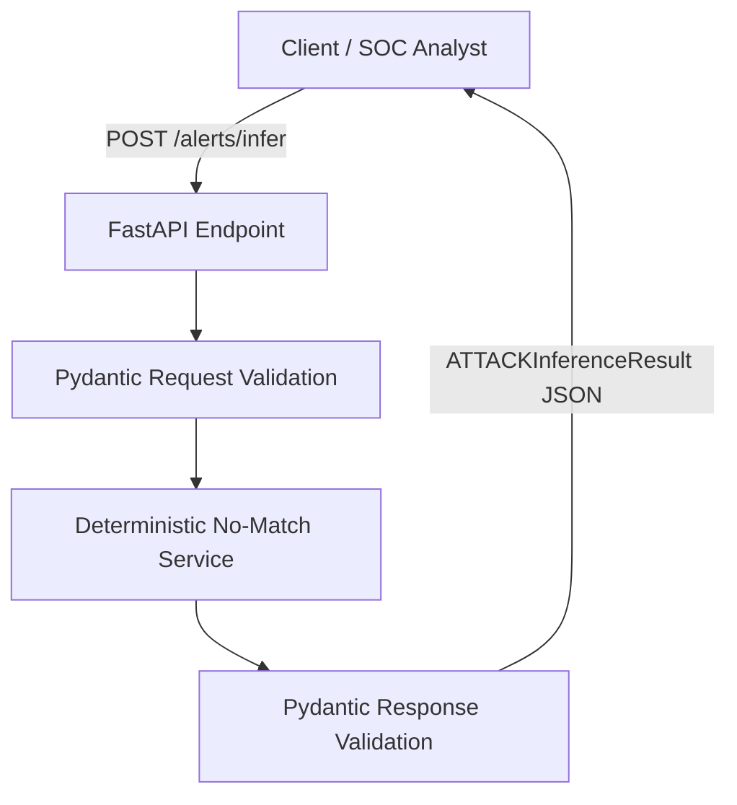
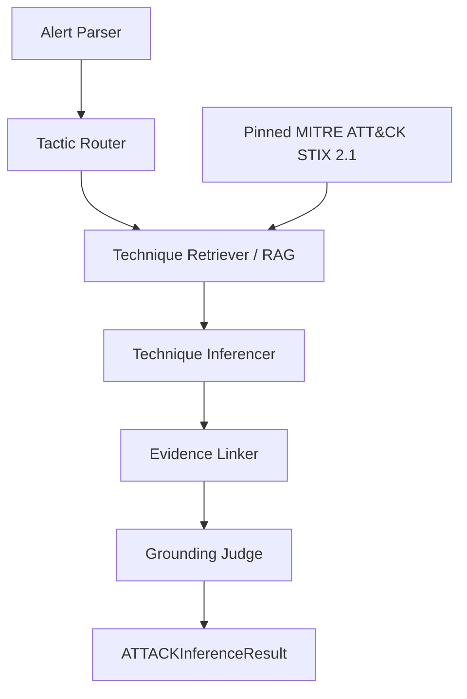
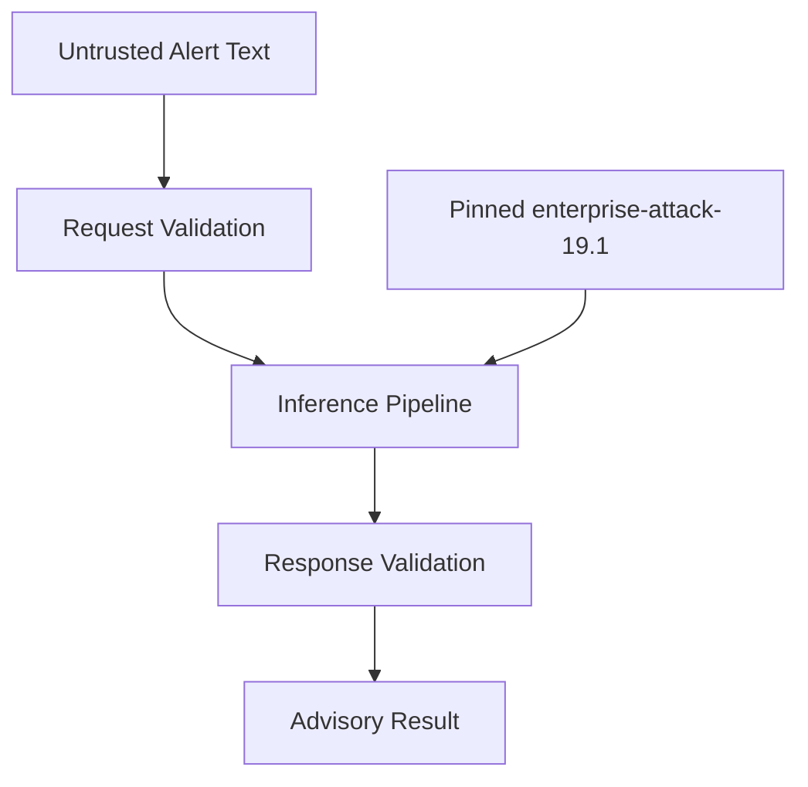

# System and Agent Architecture

## Overview

Security Alert รับข้อความแจ้งเตือนด้านความปลอดภัยผ่าน FastAPI แล้วส่งคืนผลการอนุมาน MITRE ATT&CK Technique ในรูปแบบ JSON ที่ตรวจสอบด้วย Pydantic

ระบบมีสถานะเป็น **Iteration 1 — Walking Skeleton (`v0.1.0`)** จึงคืนผล no-match แบบ deterministic พร้อมส่งต่อให้มนุษย์ตรวจ เพื่อยืนยันว่า API contract และ schema ทำงานร่วมกันได้โดยไม่สร้าง Technique ที่ไม่มีหลักฐาน ส่วน LLM, RAG, multi-agent routing และ grounding judge จริงจะพัฒนาใน iteration ถัดไป

## Iteration 1 Architecture

### Request flow

1. Client ส่ง alert ID และข้อความ security alert ไปยัง `POST /alerts/infer`
2. FastAPI รับ request และใช้ Pydantic ตรวจสอบรูปแบบข้อมูล
3. Deterministic no-match service คืนรายการ inference/candidate ว่างและตั้ง `needs_human_review=true`
4. Pydantic ตรวจสอบผลลัพธ์ตาม `ATTACKInferenceResult`
5. API ส่ง structured JSON กลับไปยัง client

## Target Agent Architecture

| Component | Responsibility | Iteration 1 status |
| --- | --- | --- |
| FastAPI endpoint | รับ request และส่ง response no-match ตาม API contract | Stub |
| Pydantic schemas | ตรวจสอบ request และ structured response | Required |
| Alert Parser | จัดรูปแบบ narrative และแยก assets, actions และ IOCs | Planned |
| Tactic Router | เลือก tactic ที่น่าจะเกี่ยวข้องเพื่อจำกัดขอบเขตการค้นหา | Planned |
| Technique Retriever | ค้นหา candidate techniques จาก pinned STIX subset | Planned |
| Technique Inferencer | เลือก Technique ID จำนวน 1–3 รายการจาก candidates | Planned |
| Evidence Linker | เชื่อม Technique กับข้อความหลักฐานจาก input | Planned |
| Grounding Judge | ปฏิเสธ Technique ที่ไม่มีหลักฐานหรือไม่มีใน taxonomy | Planned |

## Main API Contract

| Method | Endpoint | Input | Output |
| --- | --- | --- | --- |
| `POST` | `/alerts/infer` | Alert narrative | `ATTACKInferenceResult` |

ผลลัพธ์ประกอบด้วย:

- `alert_id`
- `inferred_techniques`
- `candidates_considered`
- `needs_human_review`
- `disclaimer`

## Data and Trust Boundaries

- Alert text เป็น untrusted input และต้องไม่ถูกใช้เป็นคำสั่งควบคุมระบบ
- Technique ID ต้องมีอยู่ใน pinned MITRE ATT&CK Enterprise STIX 2.1 subset เท่านั้น
- ต้องตัด Technique ที่ deprecated หรือ revoked ออกจาก candidates
- Response ทุกครั้งต้องมีข้อความว่า `Advisory tagging only. Not autonomous SOC action. Verify with senior analyst.`
- ระบบไม่ดำเนินการตอบสนองเหตุการณ์หรือบล็อกภัยคุกคามโดยอัตโนมัติ

## Planned Evolution

หลัง Iteration 1 จะเปลี่ยน `Deterministic No-Match Service` เป็น agent pipeline จริงตามลำดับ Alert Parser → Tactic Router → Technique Retriever → Technique Inferencer → Evidence Linker → Grounding Judge โดยยังคง API contract และ Pydantic response schema เดิมเพื่อรักษาความเข้ากันได้กับ client
