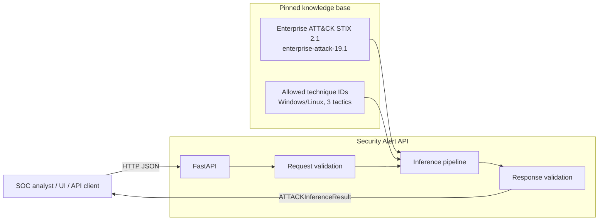
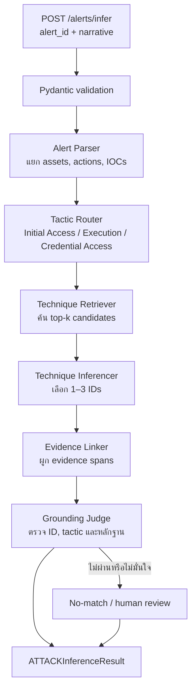

# ภาพรวม API — Security Alert → MITRE ATT&CK Inference

เอกสารนี้อธิบายภาพรวม API เป้าหมายของโครงการสำหรับใช้คุยงานและดูความสัมพันธ์ระหว่าง client, FastAPI และ inference pipeline

> แหล่งอ้างอิงหลัก: `security-alert-attack-technique-inference.md`
>
> Taxonomy ที่ใช้: MITRE ATT&CK Enterprise STIX 2.1 รุ่นตรึง `enterprise-attack-19.1`
> ผลลัพธ์เป็นคำแนะนำ (advisory) เท่านั้น ไม่สั่งตอบสนองหรือบล็อกเหตุการณ์โดยอัตโนมัติ
>
> สถานะปัจจุบัน: โมดูล inference/evidence/grounding พร้อมแล้ว แต่ `POST /alerts/infer` ยังเป็น safe no-match stub จนกว่าสาย D จะเชื่อม retriever ของสาย A

## ภาพรวม



Client ส่ง narrative ของ security alert เข้ามา แล้ว API คืน Technique ที่เกี่ยวข้องสูงสุด 1–3 รายการพร้อม confidence, tactic และข้อความหลักฐานที่พบจริงใน narrative

## เส้นทางของ `POST /alerts/infer`



Grounding Judge จะไม่ยอมให้ผลลัพธ์ผ่าน หาก Technique ID ไม่อยู่ใน candidate/allowlist, evidence ไม่พบจริงในข้อความ หรือผลมีความกำกวมเกินเกณฑ์ ในกรณีนั้น API ต้องคืนผลที่ `needs_human_review: true`

## Endpoint เป้าหมาย

| Method | Endpoint | หน้าที่ | สถานะปัจจุบัน |
| --- | --- | --- | --- |
| `GET` | `/` | health check และ STIX version | ใช้งานได้ |
| `POST` | `/alerts/infer` | วิเคราะห์ alert เดี่ยวและคืน `ATTACKInferenceResult` | safe no-match stub |
| `POST` | `/alerts/infer/batch` | วิเคราะห์ alerts หลายรายการ | วางแผน |
| `GET` | `/taxonomy/techniques` | แสดง Technique ใน pinned subset; filter ตาม tactic ได้ | ใช้งานได้ |
| `GET` | `/taxonomy/techniques/{id}` | ดูรายละเอียด Technique รายตัว | ใช้งานได้ |
| `POST` | `/rag/search` | ดู candidates ที่ retriever ค้นได้ก่อน inference | วางแผน |
| `POST` | `/evaluate` | ประเมิน predictions เทียบ gold dataset | วางแผน |

## Contract หลัก: infer alert

### Request

```json
{
  "alert_id": "demo-001",
  "narrative": "Host WIN-SRV-04 logged 847 failed RDP authentication attempts, followed by execution of encoded PowerShell."
}
```

`alert_id` เป็น optional; API สร้าง ID ให้เมื่อไม่ได้ส่งมา

### Response เมื่อ inference ผ่าน grounding

```json
{
  "alert_id": "demo-001",
  "inferred_techniques": [
    {
      "technique_id": "T1110",
      "technique_name": "Brute Force",
      "tactic": "credential-access",
      "confidence": 0.91,
      "evidence_spans": ["847 failed RDP authentication attempts"],
      "mitre_url": "https://attack.mitre.org/techniques/T1110/"
    },
    {
      "technique_id": "T1059.001",
      "technique_name": "PowerShell",
      "tactic": "execution",
      "confidence": 0.87,
      "evidence_spans": ["execution of encoded PowerShell"],
      "mitre_url": "https://attack.mitre.org/techniques/T1059/001/"
    }
  ],
  "candidates_considered": [
    {
      "technique_id": "T1110",
      "technique_name": "Brute Force",
      "tactic": "credential-access",
      "description_excerpt": "Adversaries may use password-guessing...",
      "stix_version": "19.1"
    }
  ],
  "needs_human_review": false,
  "disclaimer": "Advisory tagging only. Not autonomous SOC action. Verify with senior analyst."
}
```

### Response เมื่อไม่มีหลักฐานเพียงพอ

```json
{
  "alert_id": "benign-001",
  "inferred_techniques": [],
  "candidates_considered": [],
  "needs_human_review": true,
  "disclaimer": "Advisory tagging only. Not autonomous SOC action. Verify with senior analyst."
}
```

## ขอบเขตและ guardrails ที่ API ต้องบังคับ

- รับเฉพาะ alert text ที่ถือเป็น untrusted input และไม่ให้ข้อความนั้นควบคุม pipeline
- คืนได้เฉพาะ Technique ใน subset ที่ตรึงไว้; ตัด deprecated และ revoked ออก
- จำกัด prediction เป็น 1–3 Technique ต่อ alert
- `evidence_spans` ต้องเป็นข้อความที่พบจริงใน `narrative`
- ใส่ disclaimer และ `needs_human_review` ในทุกผลลัพธ์
- ใส่ header `X-MITRE-ATTaCK-Version: enterprise-attack-19.1` ในทุก response
- ก่อน deploy จริง ต้องจำกัด CORS และเพิ่ม authentication/rate limiting ตาม deployment target
- ไม่เก็บข้อความ Alert นอก course sandbox และไม่มี automated response capability

## สิ่งที่ต้องทำก่อน API ถึงภาพเป้าหมาย

1. ทำ retriever/index จาก pinned STIX subset และ endpoint `/rag/search`
2. เชื่อม inferencer, evidence linker และ grounding judge ที่มี tests แล้วเข้ากับ `/alerts/infer` โดยคง response schema เดิม
4. เพิ่ม batch, evaluation, typed error handling, request ID และ tests ที่ไม่เรียก Gemini จริง
5. เพิ่ม UI, deployment controls และ acceptance/security tests
