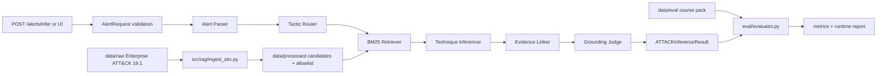

# คู่มือภาพรวมและแผนผังโค้ดทั้งโครงการ

อัปเดต 7 กันยายน 2026 บน `mai-work` หลังรวม A+B+C+D ที่ commit `6b3a38c` เอกสารนี้เป็นจุดเริ่มต้นสำหรับอ่านว่าแต่ละไฟล์ทำอะไร โค้ดเรียกต่อกันอย่างไร และข้อจำกัดใดเป็นข้อเท็จจริงปัจจุบัน ให้ใช้ [ข้อกำหนดหลัก](../security-alert-attack-technique-inference.md) เป็น Source of Truth เมื่อเอกสารนี้กับข้อกำหนดต่างกัน

## 1. ระบบนี้ทำอะไร

ระบบรับข้อความ Security Alert แล้วแนะนำ MITRE ATT&CK Technique 0–3 รายการ พร้อมชื่อ tactic, confidence, หลักฐานที่ตัดมาจากข้อความ และ `needs_human_review` สำหรับ analyst ผลลัพธ์เป็น **advisory only**: ไม่ block, quarantine, หรือทำ incident response เอง

ฐาน taxonomy คือ Enterprise ATT&CK STIX 2.1 ที่ตรึง `enterprise-attack-19.1` ใน `data/raw/` ไม่ดึง TAXII ระหว่างการทำงานปกติ ระบบจำกัด candidate เป็น Windows/Linux และ tactics `initial-access`, `execution`, `credential-access`; ขณะนี้ ingestion ได้ 127 techniques ซึ่งยังมากกว่าเป้าหมายประมาณ 30–50 ในข้อกำหนด จึงเป็นงานคงเหลือ ไม่ใช่การเปลี่ยน spec

## 2. ภาพการไหลของข้อมูล



ลำดับการเรียกจริงสำหรับ alert เดี่ยวคือ
`src/api/routes/alerts.py` → `src/inference_pipeline.py:run_inference()` →
`alert_parser.parse_alert()` → `tactic_router.route_tactics()` →
`BaselineRetriever.search()` → `technique_inferencer.infer_techniques()` →
`evidence_linker.link_evidence()` → `grounding_judge.judge_result()` →
`ATTACKInferenceResult`.

การแยกเป็นชั้นมีเหตุผลดังนี้: input/LLM output เป็น untrusted, retriever เป็นขอบเขตที่บังคับว่า ID ต้องอยู่ใน pinned KB, inferencer เลือกได้จาก candidates เท่านั้น, evidence/judge เป็นด่านสุดท้ายก่อนคืนผลให้ผู้ใช้ ดังนั้น provider ที่ตอบผิดไม่ควรทำให้ระบบสร้าง ID นอก taxonomy ได้

## 3. เริ่มใช้งานและ dependency ของไฟล์

```bash
python -m pip install -r requirements.txt
python -m src.rag.ingest_stix
GOOGLE_API_KEY='' GEMINI_API_KEY='' python -m pytest -q
GOOGLE_API_KEY='' GEMINI_API_KEY='' python -m uvicorn src.api.main:app --reload
```

ต้องรัน ingestion ก่อน import API: `alerts.py` สร้าง `BaselineRetriever` ขณะ module ถูก import และต้องอ่าน `data/processed/technique_candidates.json` กับ `technique_ids.json` ไฟล์สองนี้เป็น generated output อยู่ใน `.gitignore` และห้าม commit

ถ้าตั้ง `GOOGLE_API_KEY` หรือ `GEMINI_API_KEY` parser/router จะเรียก Gemini; ถ้าไม่มี key, timeout หรือ provider output ผิดรูปแบบ จะ fallback อย่างปลอดภัยเป็น parsed fields ว่างและค้นทั้งสาม tactics ต่อได้ สำหรับ test/evaluation ใช้ key ว่างและ runtime evaluation ปิด provider แบบ explicit

## 4. แผนผังไฟล์ทั้งหมด

### รากโครงการและการตั้งค่า

| ไฟล์/โฟลเดอร์ | หน้าที่ | ความสัมพันธ์สำคัญ |
| --- | --- | --- |
| `AGENTS.md` | กติกาการทำงานของ agent | ต้องอ่าน spec ก่อนแก้/review และต้องรัน pytest/diff/status ก่อนส่งงาน |
| `security-alert-attack-technique-inference.md` | ข้อกำหนดหลัก | กำหนด scope, schema, API, pinned STIX, metrics, guardrails |
| `README.md` | คู่มือติดตั้ง/รันแบบย่อ | ชี้ไปยังเอกสารรายละเอียด |
| `.env.example` | ชื่อตัวแปร key และ CORS ที่อนุญาต | ใช้เป็นตัวอย่างเท่านั้น; `.env` ไม่ถูก track |
| `.gitignore` | ป้องกัน secret, bytecode, `.venv`, `data/processed/` | KB processed ต้องสร้างใหม่ ไม่ commit |
| `requirements.txt` | Python runtime/test dependencies | FastAPI, Pydantic, Google GenAI, BM25, pytest |
| `.github/workflows/ci.yml` | CI Ubuntu/Python 3.11 | install → ingest → pytest แบบ key ว่าง → fixture subset eval → diff check |
| `ui/index.html` | หน้าจอ demo แบบ static | เรียก `/alerts/infer` ใน browser; serve โดย `/ui` |

### Knowledge base และ retrieval (`data/`, `src/rag/`)

| ไฟล์ | หน้าที่/เหตุผล |
| --- | --- |
| `data/raw/enterprise-attack-19.1.json` | STIX bundle ที่ track เป็น taxonomy source เดียวของ runtime |
| `src/rag/ingest_stix.py` | อ่าน `objects`, รับเฉพาะ `attack-pattern`, ตัด revoked/deprecated, กรอง 3 tactics + Win/Linux แล้ว serialize schema `TechniqueCandidate` เป็น processed JSON |
| `data/processed/technique_ids.json` | allowlist ที่ generate; guard ว่า output ID ต้องเป็น technique ที่อนุญาต |
| `data/processed/technique_candidates.json` | records ที่ retriever ใช้; generate และ ignored |
| `src/rag/embedder.py` | tokenizer offline (`\w+`, lowercase) และ interface `embed()` placeholder เพื่อเปลี่ยน dense model ภายหลังได้ |
| `src/rag/retriever.py` | โหลด candidates ผ่าน Pydantic, สร้าง BM25 index ใน memory, filter allowlist/tactic, sort score แล้ว technique ID เพื่อผลซ้ำได้ และคืน `top_k` |

ชื่อ `TextEmbedder` มีไว้ตาม contract แต่ปัจจุบัน **ไม่ใช่ dense embedding**: `embed()` คืน `[]`; BM25 ใช้ tokenization เท่านั้น จึงไม่ควรอ้างว่าใช้ vector database หรือ semantic retrieval

### Schema และ agent pipeline (`src/schemas.py`, `src/agents/`)

| ไฟล์ | รับเข้า → ส่งออก | ทำไมออกแบบแบบนี้ |
| --- | --- | --- |
| `src/schemas.py` | Pydantic `ParsedAlert`, `TechniqueCandidate`, `InferredTechnique`, `ATTACKInferenceResult` | เป็น contract กลาง; validate format ID และ confidence 0–1 ไม่ให้ endpoint/agent ส่งรูปต่างกัน |
| `alert_parser.py` | narrative → `ParsedAlert` | ส่ง prompt ที่ห่อ input เป็น JSON/delimiter, parse provider JSON แล้วสร้าง Pydantic object; failure คืน narrative เดิมกับ lists ว่าง ไม่เชื่อ provider โดยตรง |
| `tactic_router.py` | `ParsedAlert` → tactics ที่อยู่ใน 3 ค่าเท่านั้น | provider JSON list ถูก allowlist; malformed/failure คืนทั้งสาม tactic เพื่อลด false negative จาก router |
| `gemini_client.py` | prompt → text | สร้าง client เมื่อถูกเรียก, อ่าน key สองชื่อ, timeout 10 วินาทีและ retry transient HTTP errors; ไม่สร้าง client เมื่อไม่มี key |
| `technique_inferencer.py` | narrative + candidates → 0–3 `InferredTechnique` | baseline lexical overlap อย่างน้อย 2 terms, tie-break deterministic; ไม่มี LLM เพื่อบังคับ candidate-bounded inference และ reproducibility offline |
| `evidence_linker.py` | inferred techniques → grounded techniques | เก็บเฉพาะ evidence span ที่เป็น exact substring และมีตัวอักษร/ตัวเลขอย่างน้อย 4 ตัว ทำให้ analyst ตรวจย้อนกลับได้ |
| `grounding_judge.py` | narrative + inferred + candidates → bool review | review เป็น `true` เมื่อ no-match, >3, duplicate, candidate name/tactic/ID ไม่ตรง, evidence หาย หรือ confidence <0.65 |

Judge ปัจจุบันเป็น **structural grounding check** ไม่ใช่ semantic LLM judge: ข้อความ evidence อยู่ใน narrative ไม่ได้พิสูจน์ว่าเหตุการณ์หมายถึง technique นั้นจริง จึงยังต้อง human review และงาน semantic grounding ต่อไป

### API และ UI (`src/api/`)

| ไฟล์ | Endpoint/งาน | การป้องกัน |
| --- | --- | --- |
| `main.py` | สร้าง FastAPI, CORS localhost default, request ID/ATT&CK version headers, `/`, `/ui` | request ID รับเฉพาะ pattern จำกัดความยาว; log method/path/status/latency |
| `routes/alerts.py` | `POST /alerts/infer`, `POST /alerts/infer/batch` | narrative ≤20,000, batch ≤25; typed 503/504/500; item ที่ fail ใน batch เป็น no-match+review แทนการ fabricate prediction |
| `routes/rag.py` | `POST /rag/search` | tactic allowlist และ strict `top_k` 1–25; คืน candidates เพื่อ inspect retrieval |
| `routes/taxonomy.py` | `GET /taxonomy/techniques`, `GET /taxonomy/techniques/{id}` | อ่าน pinned processed candidate only; unknown ID เป็น 404 |
| `routes/evaluate.py` | `POST /evaluate` | รับแค่ `mode=fixture|runtime`, `top_k=1..25`; ห้าม path, raw alert, key, provider config; ไม่มีการเขียน report ลง disk |

`/alerts/infer` ใช้ provider ได้ตาม key ส่วน `/evaluate` ใช้ `create_report()` runtime ที่ส่ง `use_provider=False` เสมอ จึงปลอดภัยสำหรับ reproducible offline evaluation แม้ `.env` มี key

### Evaluation (`data/eval/`, `eval/`)

| ไฟล์ | หน้าที่ |
| --- | --- |
| `alerts-v1.0.json` | course pack synthetic/sanitized 35 records: 20 positive, 5 multi, 5 ambiguous, 5 negative; labels ยัง `pending_independent_review` |
| `saved_predictions-v1.0.json` | deterministic fixture predictions; ใช้ตรวจ metric/validator ไม่ใช่ output โมเดลจริง |
| `technique_ids-v19.1.json` | snapshot allowlist ที่ evaluator ต้องเท่ากับ generated allowlist |
| `iteration-2-v0.2.0-subset.json` | รายชื่อ 10 records คงที่สำหรับ Iteration 2 release evaluation; ไม่แก้หรือแทน full course pack |
| `report-v1.0.json` | fixture report เดิม; perfect score ตรวจความถูกต้องของ metric เท่านั้น |
| `eval/run_eval.py` | CLI validation, gold/prediction isolation, `--subset iteration-2|full`, optional output และ quality-gate exit status |
| `eval/evaluator.py` | ตรวจ hashes/version/allowlist/candidates, เรียก fixture หรือ pipeline runtime, เลือก subset, สร้าง metadata + metrics + gates |
| `eval/metrics.py` | exact micro P/R/F1, parent partial recall 0.5, substring grounding, hallucinated IDs, FPR, review rate, Recall@k |
| `eval_report.md` | ผล runtime release subset ที่ track; ใช้อ่านผล ไม่ใช่ source of truth ของ metrics |

CLI release run คือ `python -m eval.run_eval --mode runtime --subset iteration-2`; fixture เป็น smoke test ของ data/metric, runtime เป็นการรัน A+B pipeline จริงแบบ offline. `--require-quality-gates` คืน 1 เมื่อ F1/parent/grounding/hallucination ยังไม่ผ่าน แม้ runner ทำงานสำเร็จ

### Tests (`tests/`)

| ไฟล์ | ตรวจอะไร |
| --- | --- |
| `test_schemas.py` | Pydantic schema และ ID/confidence validation |
| `test_ingest_stix.py` | filter tactic/platform/deprecated/revoked และ output paths |
| `test_embedder.py` | tokenization และ placeholder contract |
| `test_retriever.py` | BM25 ranking, tactic/allowlist/top-k และ deterministic behavior |
| `test_agents.py` | parser/router/inferencer/linker/judge behavior |
| `test_gemini_client.py` | key requirement และ SDK timeout/retry config ด้วย mock |
| `test_inference_guardrails.py` | malformed output, prompt injection delimiter, candidate/evidence/confidence constraints |
| `test_alerts_api.py` | inference single/batch request/response/error boundaries |
| `test_rag_api.py`, `test_taxonomy_api.py`, `test_api.py` | API validation, headers, CORS, health/UI/taxonomy/retrieval |
| `test_metrics.py` | metric formulas, dataset/prediction schema validation |
| `test_evaluation_integration.py` | gold overwrite rejection, KB/version drift, offline provider sentinel, API safety, subset and CLI gates |

### Documentation (`docs/`)

| ไฟล์ | ใช้เมื่อ |
| --- | --- |
| `PROJECT_READING_GUIDE_TH.md` | เลือกลำดับอ่านเอกสาร |
| `PROJECT_FILE_MAP_TH.md` | ต้องการตารางย่อว่าไฟล์ใดทำอะไร |
| `PROJECT_REVIEW_TH.md` | ต้องการ findings, ข้อจำกัด, และผลตรวจล่าสุด |
| `COMPLETE_PROJECT_GUIDE_TH.md` | ต้องการคำอธิบาย end-to-end และทุกกลุ่มไฟล์ (เอกสารนี้) |
| `architecture.md` | ต้องการภาพ runtime/data/provider boundary |
| `API_OVERVIEW_TH.md` | ต้องการ request/response/error contract |
| `A_B_PIPELINE_INTEGRATION_TH.md`, `MAI_WORK_INFERENCE_GUARDRAILS_TH.md` | ต้องการรายละเอียด pipeline/guardrails |
| `C_*`, `D_*`, `TEAM_WORK_*` | ประวัติการรวมงานและเครดิตสายงาน |
| `WORK_PLAN_TH.md`, `HANDOFF_TH.md` | งานคงเหลือและส่งต่องาน |

## 5. สิ่งที่ทำแล้ว และสิ่งที่ยังไม่ควรอ้างว่าเสร็จ

ทำแล้ว: ingestion จาก pinned STIX, BM25 candidate retrieval, A+B agent pipeline, FastAPI/UI, Pydantic contracts, provider-safe fallback, evidence/candidate guardrails, CI ingestion/test/eval smoke, course evaluation + Iteration 2 subset, runtime report และ tests 101 รายการ

ยังคงเหลือก่อนอ้างว่า final demo/production ready:

1. Runtime subset quality ยัง F1 34.48% และ parent recall 50% ต่ำกว่า target 70%/90%.
2. Evidence grounding เป็น substring-only; ต้องเพิ่ม semantic/negation/ambiguous evaluation.
3. Gold labels เป็น RC และต้องให้อาจารย์/ผู้ตรวจอิสระอนุมัติ.
4. Candidate 127 รายการเกิน target 30–50; ต้องตกลง subset โดยไม่แก้เกณฑ์ตามโค้ด.
5. ไม่มี authentication, rate limit, retention/redaction enforcement หรือ full security audit.
6. `app.version` ยัง `0.1.0`; หากจะ tag/release v0.2.0 ต้องตัดสินใจ versioning policy ก่อนปรับ.
7. ไม่มี dense embedding, semantic retriever, live-provider acceptance test หรือ prompt registry (ข้อสุดท้ายไม่จำเป็นสำหรับ Iteration 2).

## 6. ลำดับงานที่แนะนำ

1. ใช้ `PROJECT_REVIEW_TH.md` และ `eval_report.md` ยืนยัน baseline กับทีม/ผู้สอน.
2. ล็อก 30–50 candidate subset และตรวจ gold labels ก่อน tuning เพื่อไม่ให้วัดบนเป้าหมายที่เปลี่ยน.
3. เพิ่ม semantic evidence/negation handling และ regression tests จาก false positives.
4. ปรับ inference/retrieval บน development data แยกจาก evaluation set; รัน `--require-quality-gates` ทุกครั้ง.
5. ก่อน deploy ค่อยเพิ่ม auth, rate limit, retention/redaction, provider consent และ live-provider testing.

## 7. คำสั่งตรวจมาตรฐาน

```bash
python -m src.rag.ingest_stix
GOOGLE_API_KEY='' GEMINI_API_KEY='' python -m pytest -q
GOOGLE_API_KEY='' GEMINI_API_KEY='' python -m eval.run_eval --mode fixture --subset iteration-2
GOOGLE_API_KEY='' GEMINI_API_KEY='' python -m eval.run_eval --mode runtime --subset iteration-2
git diff --check
git status --short
```
