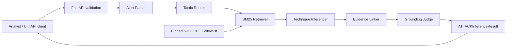
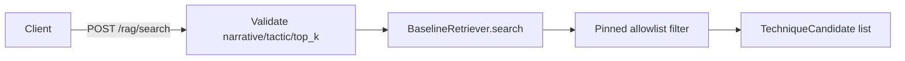

# สรุปงานสาย D และสถานะระบบก่อนรวมสาย C

อัปเดต: 7 กันยายน 2026
สถานะเอกสาร: **สถานะปัจจุบันสำหรับจุดส่งต่อ D → C**
สาขาที่ตรวจ: `feature-d-integration`
commit ล่าสุด: `5718f2aa657a90009f32a2720e09d789a8729573`
สาขาปลายทางของ D: `mai-work`
Source of Truth: `security-alert-attack-technique-inference.md`

## สรุปสำหรับทีม

สาย D สำหรับ local MVP ทำเสร็จแล้วบน `feature-d-integration` และเชื่อมกับงาน A+B โดยไม่เปลี่ยน schema, BM25 retriever, pinned STIX หรือ inference guardrails

ระบบปัจจุบันรองรับ:

- วิเคราะห์ Alert เดี่ยวผ่าน `POST /alerts/infer`
- วิเคราะห์ Alert แบบ batch ผ่าน `POST /alerts/infer/batch`
- ตรวจ candidates ก่อน inference ผ่าน `POST /rag/search`
- ดู taxonomy ผ่าน `GET /taxonomy/techniques` และ `GET /taxonomy/techniques/{id}`
- เปิด UI สำหรับ local demo ผ่าน `GET /ui`
- ติดตาม request ด้วย `X-Request-ID`
- ระบุ pinned taxonomy ด้วย `X-MITRE-ATTaCK-Version`
- จัดการ timeout และ internal failure โดยไม่ส่ง exception/secret กลับ client
- รัน CI และ tests แบบ offline โดยไม่ใช้ Gemini key

สิ่งที่ยังไม่รวมใน branch ปัจจุบันคือสาย C: dataset, evaluation metrics, evaluation runner และ `/evaluate`

## ประวัติและเครดิตของสาย D เดิม

งาน D เดิมอยู่ที่:

```text
branch:  feature-branch
commit:  c35c1562133776c8f35acc5c773d485a9e0509ac
author:  thitareesangrasamepen-cyber
```

commit ดังกล่าวถูก merge เป็น parent ของ commit `5718f2a` เพื่อรักษาประวัติและเครดิตใน Git โดยตรง

ส่วนที่นำมาใช้ต่อจากงานเดิม:

- รูปแบบ analyst UI และลำดับกรอก Alert → แสดง prediction/evidence → แสดง review/candidates
- แนวคิด batch endpoint
- product-shell test scenarios
- skeleton ของ CI
- แนวคิด typed failure และ request tracing

ส่วนที่ต้องปรับก่อนใช้งาน:

- เปลี่ยน UI จาก schema `prediction/confidence/candidates` เป็น `ATTACKInferenceResult`
- เปลี่ยน API จาก fake hard-coded result เป็น `run_inference()` ของ A+B
- แก้ batch path เป็น `/alerts/infer/batch`
- เปลี่ยน test ให้ใช้ canonical schema และไม่ skip regression
- เปลี่ยน CI ให้ไม่ตั้ง dummy provider key
- ตัด ChromaDB, duplicate agents และ STIX processor ชุดที่สองซึ่งขัดกับ baseline ปัจจุบัน

## ภาพรวมระบบปัจจุบัน



เส้นทาง RAG inspection แยกจาก inference:



## การทำงานของแต่ละ endpoint

| Method | Endpoint | สถานะ | การทำงาน |
| --- | --- | --- | --- |
| `GET` | `/` | พร้อม | health check และ STIX version |
| `GET` | `/ui` | พร้อมสำหรับ local demo | UI กรอก narrative และแสดง advisory result |
| `POST` | `/alerts/infer` | พร้อมระดับ baseline | เรียก pipeline A+B จริงและคืน `ATTACKInferenceResult` |
| `POST` | `/alerts/infer/batch` | พร้อม | วิเคราะห์ 1–25 alerts ตามลำดับ input |
| `POST` | `/rag/search` | พร้อม | คืน BM25 candidates ด้วย tactic/top-k filter |
| `GET` | `/taxonomy/techniques` | พร้อม | list/filter pinned candidates |
| `GET` | `/taxonomy/techniques/{id}` | พร้อม | ดู pinned candidate ราย ID |
| `POST` | `/evaluate` | ยังไม่พร้อม | รอรวม evaluation runner ของสาย C |

### Single inference

request รับ `alert_id` แบบ optional และ narrative ความยาว 1–20,000 ตัวอักษร หลัง trim whitespace แล้ว

```json
{
  "alert_id": "demo-001",
  "narrative": "Multiple failed RDP logins followed by encoded PowerShell execution."
}
```

route เรียก `run_inference()` โดยใช้ `BaselineRetriever` ชุดเดียวกับระบบ ไม่ใช้ fake pipeline ใน runtime

### Batch inference

batch รับ 1–25 alerts และรักษาลำดับ response ให้ตรงกับ input หากบางรายการเกิด timeout หรือ internal failure รายการนั้นจะกลายเป็น safe no-match:

```json
{
  "alert_id": "failed-item",
  "inferred_techniques": [],
  "candidates_considered": [],
  "needs_human_review": true,
  "disclaimer": "Advisory tagging only. Not autonomous SOC action. Verify with senior analyst."
}
```

exception string จะไม่ถูกนำไปใส่ใน prediction หรือ evidence

### RAG search

`POST /rag/search` รับ:

- narrative ความยาว 1–20,000 ตัวอักษร
- `top_k` เป็น integer ช่วง 1–25
- tactic เป็น list ของ `initial-access`, `execution`, `credential-access`

เมื่อไม่ส่ง tactic หรือส่ง list ว่าง ระบบค้นทั้งสาม tactics ผลลัพธ์มาจาก pinned candidates และ allowlist เท่านั้น

## Schema และ contract ที่ใช้ร่วมกับ C

สาย C ต้องถือผลลัพธ์นี้เป็น runtime prediction contract:

```python
class ATTACKInferenceResult(BaseModel):
    alert_id: str
    inferred_techniques: list[InferredTechnique]
    candidates_considered: list[TechniqueCandidate]
    needs_human_review: bool
    disclaimer: str
```

ข้อกำหนดสำคัญ:

- `confidence` เป็น float ช่วง 0–1
- candidate/prediction ใช้ `tactic: str`
- prediction ต้องมาจาก candidates ที่พิจารณา
- Technique ID ต้องอยู่ใน pinned allowlist
- evidence span ต้องพบจริงใน narrative
- no-match และผลไม่แน่ใจต้องส่ง human review

สาย C ไม่ควรเปลี่ยน schema นี้เพื่อให้เข้ากับ saved predictions แต่ควรมี adapter/validation ที่แปลง evaluation fixture ให้ตรวจ contract เดียวกัน

## Error handling และ request tracing

ทุก response มี:

```text
X-Request-ID: <validated client ID or generated UUID>
X-MITRE-ATTaCK-Version: enterprise-attack-19.1
```

request ID ที่ client ส่งมาต้องประกอบด้วยตัวอักษร ตัวเลข `.`, `_`, `:`, `-` และยาวไม่เกิน 128 ตัวอักษร หากไม่ผ่านระบบจะสร้าง UUID ใหม่

typed errors สำหรับ single inference:

| HTTP | Code | ความหมาย |
| ---: | --- | --- |
| 422 | validation response | request ไม่ผ่าน Pydantic validation |
| 503 | `KNOWLEDGE_BASE_UNAVAILABLE` | pinned knowledge base ใช้งานไม่ได้ |
| 504 | `INFERENCE_TIMEOUT` | inference timeout และต้อง human review |
| 500 | `INTERNAL_ERROR` | เกิดข้อผิดพลาดภายในที่ไม่เปิดเผยรายละเอียด |

ระบบ log เฉพาะ method, path, status, latency และ request ID ไม่ log raw narrative ใน request middleware

## Provider timeout/retry

Gemini client สร้างเมื่อมีการเรียกจริง ไม่สร้างตอน import และตั้งค่า:

```text
timeout: 10,000 ms
retry attempts: 3
retry statuses: 408, 429, 500, 502, 503, 504
```

เมื่อไม่มี `GOOGLE_API_KEY` หรือ `GEMINI_API_KEY`, parser/router ใช้ safe fallback และ automated tests ยังทำงานได้โดยไม่เรียก network

## UI ปัจจุบัน

UI ใช้ workflow/layout ที่พัฒนาต่อจากสาย D เดิม และแก้ให้ตรงกับ schema ปัจจุบัน:

- ส่ง narrative ไป `/alerts/infer`
- แสดง alert ID
- แสดง technique ID, name, tactic, confidence และ evidence แยกรายการ
- แสดง MITRE URL
- แสดง candidates ที่พิจารณา
- แสดง `needs_human_review`
- แสดง disclaimer จาก API
- แสดง safe error พร้อม request ID
- ใช้ `textContent` สำหรับข้อมูลจาก API เพื่อลดความเสี่ยงจาก untrusted input
- ใช้ CSS ใน repository ไม่พึ่ง Tailwind CDN จึงเปิด local demo แบบ offline ได้

UI เปิดผ่าน:

```text
http://127.0.0.1:8000/ui
```

## CORS และขอบเขตการ deploy

default CORS จำกัดไว้ที่:

```text
http://127.0.0.1:8000
http://localhost:8000
```

สามารถกำหนดผ่าน `CORS_ALLOWED_ORIGINS` แบบ comma-separated ได้

สถานะปัจจุบันเป็น local MVP ยังไม่ใช่ production deployment เพราะยังไม่ได้กำหนด:

- authentication
- rate limiting
- production origin allowlist
- privacy/retention policy
- deployment-specific acceptance/security tests

รายการเหล่านี้ต้องกำหนดเมื่อทีมเลือก deployment target และก่อนรับ raw alert จริง

## CI และการตรวจสอบ

GitHub Actions workflow อยู่ที่ `.github/workflows/ci.yml` และทำงานกับ:

- push เข้า `main`, `mai-work`, `feature-d-integration`
- pull request เข้า `main` หรือ `mai-work`

CI ใช้ Python 3.11, ติดตั้งจาก `requirements.txt`, ถอน provider keys ออกจาก environment แล้วรัน:

```bash
python -m pytest -q
git diff --check
```

ผลตรวจล่าสุดบน commit `5718f2a`:

```text
python -m pytest -q                  62 passed
python -m compileall -q src eval tests  ผ่าน
git diff --check                    ผ่าน
git status --short                  สะอาด
```

## สิ่งที่สาย D ไม่ได้เปลี่ยน

- Pydantic schema ใน `src/schemas.py`
- BM25 algorithm และ ranking ใน `src/rag/`
- pinned STIX `enterprise-attack-19.1`
- processed candidates และ allowlist
- inference/evidence/grounding rules ของ A+B
- ขอบเขต tactics และ platforms
- advisory-only behavior

## ช่องว่างที่ยังเหลือก่อนประเมิน MVP

ช่องว่างเหล่านี้ไม่ใช่งาน D ที่ยังทำไม่เสร็จ แต่เป็นงานรวมของ A/B/C หรือการตัดสินใจของทีม:

1. สาย A ยังไม่มี platform/source metadata ใน `TechniqueCandidate`
2. subset ปัจจุบันมี 127 candidates ขณะที่ specification ตั้งเป้าประมาณ 30–50
3. สาย B ยังตรวจ evidence แบบ structural exact substring และยังไม่มี semantic grounding
4. สาย C ยังไม่ถูกรวมและ `/evaluate` ยังไม่เปิดใช้
5. ยังไม่มีผล quality gate จาก pipeline จริง
6. production controls รอ deployment target

## ลำดับก่อนรวมสาย C

1. เปิด Pull Request จาก `feature-d-integration` เข้า `mai-work`
2. รอ CI ของ PR ผ่านและตรวจ changed files
3. merge D เข้า `mai-work`
4. ให้สาย C นำ `mai-work` หลังรวม D เป็นฐานใหม่
5. แก้รายการใน `C_EVALUATION_REVIEW_TH.md`
6. นำเฉพาะ data/eval, metrics, runner และ tests ของ C เข้ามา โดยใช้เอกสารปัจจุบันจาก `mai-work` เป็นฐาน
7. เพิ่ม `/evaluate` เมื่อ evaluation runner และ schema ตกลงกันแล้ว
8. รัน evaluation แยก fixture-validation ออกจาก runtime-quality report

## Contract สำหรับการรวม C

สาย C ต้องไม่ทำให้สิ่งต่อไปนี้ถอยกลับ:

- `/alerts/infer` ต้องยังเรียก pipeline จริง
- `/alerts/infer/batch` และ `/rag/search` ต้องยังใช้งานได้
- UI ต้องยังอ่าน `ATTACKInferenceResult`
- tests ต้องไม่เรียก Gemini/network จริง
- CI ต้องยังผ่านโดยไม่มี provider key
- evaluation allowlist ต้องผูกกับ `data/processed/technique_ids.json`
- saved fixture report ต้องระบุว่าไม่ใช่ runtime quality gate
- เอกสารสถานะต้องไม่ย้อนกลับไปบอกว่า A+B หรือ D ยังไม่เชื่อม

## เกณฑ์พร้อมเริ่มรวม C

ถือว่าระบบพร้อมเริ่มรวม C เมื่อ:

- PR ของ D เข้า `mai-work` ถูก review และ CI ผ่าน
- merge D เสร็จและ `mai-work` ผ่าน tests ทั้งหมด
- สาย C rebase/merge จาก `mai-work` ล่าสุด
- parent partial-credit rule ถูกตกลงและแก้แล้ว
- dataset/prediction validation ครบตาม review
- evaluation report แยก fixture validation ออกจาก runtime quality

หลังครบรายการนี้ จึงเชื่อม `/evaluate` และรัน quality gates ตาม specification ได้อย่างไม่ทำให้ A+B+D regression
