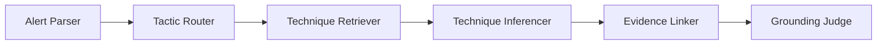

# บทนำเสนอ Security-Alert สำหรับผู้พูด 4 คน

เวลาประมาณ 10–12 นาที เน้นทฤษฎีและเหตุผลในการออกแบบ พร้อมตัวอย่างสั้น ๆ
ปรับคำลงท้ายและชื่อผู้พูดตามทีมได้ เวลาจริงควรจับเวลาขณะซ้อม

อ้างอิง [ข้อกำหนดหลัก](../security-alert-attack-technique-inference.md)
หัวข้อ Agent Architecture, Knowledge Base, Evaluation, Security & Guardrails และแผนสาธิต

## ข้อเท็จจริงที่ทั้งทีมต้องพูดให้ตรงกัน

- เป้าหมายตามข้อกำหนดคือ RAG ร่วมกับ zero-shot inference
- เวอร์ชัน UI/API ปัจจุบันใช้ BM25 และกฎพฤติกรรมแบบ offline ไม่เรียก Gemini
- มีการเชื่อม Gemini สำหรับ Parser และ Router แต่แม้เปิด provider ขั้นเลือก Technique ยังใช้กฎ
- คะแนน 97.30% เป็นผลของ offline pipeline ไม่ใช่ผล Gemini
- Confidence เป็นคะแนนตามกฎ ไม่ใช่เปอร์เซ็นต์ความถูกต้องที่สอบเทียบแล้ว
- Gold labels/subset ยังต้องรับรอง และชุดประเมินเคยใช้วิเคราะห์ข้อผิดพลาดระหว่างพัฒนา

## การแบ่งบท

| ผู้พูด | เนื้อหาหลัก | เวลา |
| --- | --- | --- |
| คนที่ 1 | ปัญหา เป้าหมาย และ MITRE ATT&CK | 2–3 นาที |
| คนที่ 2 | ฐานความรู้ การค้นหา และแนวคิด RAG | 2–3 นาที |
| คนที่ 3 | การอนุมาน หลักฐาน และความปลอดภัย | 3 นาที |
| คนที่ 4 | การประเมินผล ตัวอย่างใช้งาน และข้อจำกัด | 3 นาที |

## คนที่ 1 — ทำไมต้องมีระบบนี้ และใช้ MITRE ATT&CK อย่างไร

สไลด์: ชื่อโครงการ → ปัญหา → MITRE ATT&CK และขอบเขต

### บทพูด

สวัสดีครับ วันนี้กลุ่มของเรานำเสนอโครงการ Security Alert ซึ่งเป็นระบบช่วยอนุมาน MITRE ATT&CK Technique จากข้อความแจ้งเตือนด้านความปลอดภัย

ปัญหาที่เราเริ่มต้นคือ ข้อความแจ้งเตือนมักบอกเหตุการณ์ทางเทคนิค แต่ยังไม่ได้อธิบายอย่างเป็นมาตรฐานว่าเหตุการณ์นั้นเกี่ยวข้องกับพฤติกรรมการโจมตีประเภทใด นักวิเคราะห์จึงต้องอ่านข้อความ ทำความเข้าใจบริบท และค้นหาข้อมูลประกอบด้วยตนเอง

ตัวอย่างเช่น log ระบุว่าเครื่องหนึ่งมีการเข้าสู่ระบบผิดพลาดหลายร้อยครั้ง และหลังจากนั้นมีการรัน PowerShell นักวิเคราะห์ต้องพิจารณาว่าสองเหตุการณ์นี้อาจสัมพันธ์กับ Brute Force และการใช้ PowerShell เพื่อดำเนินคำสั่งหรือไม่

โครงการของเราจึงรับข้อความ Alert แล้วแนะนำ Technique ที่อาจเกี่ยวข้อง พร้อมแสดงข้อความหลักฐาน เพื่อให้นักวิเคราะห์ตรวจสอบต่อได้

ฐานความรู้ที่เราใช้คือ MITRE ATT&CK ซึ่งรวบรวมและจัดหมวดหมู่พฤติกรรมของผู้โจมตี โดยมีคำสำคัญสามระดับ

Tactic อธิบายเป้าหมายของการกระทำ เช่น ต้องการเข้าถึงระบบ หรือเข้าถึงข้อมูลรับรอง ส่วน Technique อธิบายวิธีที่ใช้เพื่อบรรลุเป้าหมายนั้น และ Sub-technique เป็นรายละเอียดที่เฉพาะเจาะจงลงไป

เช่น Execution เป็น tactic ส่วน Command and Scripting Interpreter เป็น technique และ PowerShell รหัส T1059.001 เป็น sub-technique

การใช้รหัสมาตรฐานช่วยให้ทีมสื่อสารตรงกัน แม้ข้อความ log จากแต่ละเครื่องมือจะแตกต่างกัน

สำหรับโครงการนี้ เราจำกัดการวิเคราะห์ไว้ที่ Initial Access, Execution และ Credential Access บน Windows และ Linux เพื่อให้พัฒนาและประเมินผลได้ในขอบเขตที่ชัดเจน

ระบบมีหน้าที่ให้คำแนะนำ ไม่ได้สั่งบล็อกเครื่องหรือจัดการเหตุการณ์โดยอัตโนมัติ การตัดสินใจสุดท้ายยังเป็นหน้าที่ของนักวิเคราะห์ครับ

### ประโยคส่งต่อ

เมื่อเรามีมาตรฐานสำหรับอธิบายพฤติกรรมแล้ว ขั้นต่อไปคือทำอย่างไรให้ระบบค้นหาความรู้ที่เกี่ยวข้องกับ log ได้ ขอส่งต่อให้เพื่อนอธิบายส่วนฐานความรู้และ retrieval ครับ

## คนที่ 2 — ฐานความรู้, BM25 และแนวคิด RAG

สไลด์: การเตรียม STIX → Retrieval → สถาปัตยกรรมเป้าหมายกับเวอร์ชันปัจจุบัน

### บทพูด

ส่วนของผมอธิบายว่าระบบค้นหาความรู้ประกอบการวิเคราะห์อย่างไรครับ

เราใช้ข้อมูล MITRE ATT&CK ในรูปแบบ STIX ซึ่งเป็นรูปแบบข้อมูลที่เครื่องสามารถอ่านและประมวลผลได้ ภายในมีรหัส Technique ชื่อ คำอธิบาย tactic และ platform ที่เกี่ยวข้อง

โครงการตรึงข้อมูลไว้ที่ Enterprise ATT&CK รุ่น 19.1 เพื่อให้การทดสอบแต่ละครั้งอ้างอิงฐานความรู้เวอร์ชันเดียวกัน หากฐานความรู้เปลี่ยนระหว่างทดลอง เราจะแยกได้ยากว่าคะแนนที่เปลี่ยนเกิดจากโค้ดหรือข้อมูล

ก่อนนำมาใช้ ระบบจะกรองตามขอบเขต และตัดรายการที่ถูกยกเลิกหรือเลิกแนะนำให้ใช้ออก

สำหรับหลักการค้นหา ปัจจุบันเราใช้ BM25 ซึ่งเป็นวิธีจัดอันดับความเกี่ยวข้องของข้อความจากคำที่ปรากฏใน query และเอกสาร

อธิบายง่าย ๆ คือ ระบบพิจารณาว่าคำใน Alert ตรงกับคำอธิบาย Technique มากแค่ไหน โดยคำที่พบไม่บ่อยในฐานข้อมูลมักช่วยแยกความเกี่ยวข้องได้มากกว่าคำทั่วไป และมีการปรับผลตามความยาวของเอกสารด้วย

เมื่อรับ log ที่กล่าวถึงการเข้าสู่ระบบผิดพลาดและ PowerShell ระบบจะค้นหาคำอธิบาย Technique ที่เกี่ยวข้อง แล้วจัดอันดับเป็น candidates โดยในการสาธิตเราแสดงห้าอันดับแรก หรือ top-5

สิ่งสำคัญคือ retrieval ยังไม่ได้ตัดสินว่า Technique นั้นเกิดขึ้นจริง แต่กำลังเสนอรายการที่ควรนำไปพิจารณาต่อ

แนวคิดนี้เป็นส่วนต้นของสถาปัตยกรรม RAG หรือ Retrieval-Augmented Generation ซึ่งค้นหาความรู้ภายนอกมาเป็นบริบทให้โมเดลใช้สร้างคำตอบ

ข้อกำหนดของโครงการวางเป้าหมายเป็น RAG ร่วมกับ zero-shot inference หมายถึงให้โมเดลทำงานตามคำสั่งและบริบท โดยไม่ต้องฝึกโมเดลเฉพาะงานนี้เพิ่มเติม และไม่ให้ตัวอย่างคำตอบเฉพาะงานในลักษณะ few-shot

อย่างไรก็ตาม เวอร์ชันที่เราใช้งานและวัดคะแนนตอนนี้เป็น offline baseline คือใช้ BM25 ร่วมกับกฎพฤติกรรมในการเลือก Technique ยังไม่ได้ใช้ Gemini สร้างผลอนุมานขั้นสุดท้าย

เราเตรียมการเชื่อม Gemini ไว้ในส่วนแยกข้อมูลจาก Alert และจัดกลุ่ม tactic แต่เส้นทาง UI ปัจจุบันยังปิดการเรียกบริการภายนอกอยู่ครับ

### ประโยคส่งต่อ

เมื่อได้ candidates แล้ว ระบบยังต้องตรวจว่ารายการใดมีหลักฐานรองรับจริง ส่วนต่อไปจะอธิบายการอนุมานและการตรวจสอบคำตอบครับ

## คนที่ 3 — Inference, Grounding และ Guardrails

สไลด์: Pipeline 6 ขั้น → ตัวอย่าง evidence → Guardrails

### บทพูด

โครงการแบ่งการทำงานเป็นหกส่วน ได้แก่ Parser, Router, Retriever, Inferencer, Evidence Linker และ Grounding Judge

คำว่า Agent ในที่นี้หมายถึงองค์ประกอบที่มีหน้าที่เฉพาะ ไม่ได้หมายความว่าทุกส่วนต้องเป็น LLM หรือทำงานอย่างอิสระทั้งหมด

Parser มีหน้าที่แยกข้อมูล เช่น เครื่องที่เกี่ยวข้อง การกระทำ และ IOC ส่วน Router เลือกกลุ่ม tactic เพื่อช่วยจำกัดการค้นหา ในโหมด offline ปัจจุบัน ระบบคงข้อความต้นฉบับและค้นหาครบทั้งสาม tactics เพื่อไม่ให้การจัดกลุ่มที่ไม่แน่นอนตัดคำตอบที่เกี่ยวข้องออกไป

เมื่อ Retriever ส่ง candidates มาแล้ว Inferencer จะพิจารณาว่าพฤติกรรมในข้อความสนับสนุน Technique ใดบ้าง โดยเวอร์ชันปัจจุบันใช้กฎตรวจรูปแบบการกระทำและบริบท

ตัวอย่างเช่น การพบคำว่า PowerShell อย่างเดียวไม่ควรเพียงพอ เพราะข้อความอาจบอกว่าไม่ได้รัน PowerShell หรือเป็นงานดูแลระบบที่ได้รับอนุญาต เราจึงต้องพิจารณาคำที่บอกการกระทำ คำปฏิเสธ และบริบทของกิจกรรมด้วย

อีกหลักการหนึ่งคือ multi-label classification เพราะ Alert หนึ่งรายการอาจมีมากกว่าหนึ่งพฤติกรรม ระบบจึงรองรับการแนะนำหนึ่งถึงสาม Techniques เมื่อมีหลักฐานรองรับ หรือไม่คืน Technique เลยเมื่อหลักฐานไม่เพียงพอ

หลังจากเลือกผลแล้ว Evidence Linker จะเชื่อมแต่ละ Technique เข้ากับข้อความจริงใน Alert เพื่อให้ผู้ใช้ตรวจสอบได้ว่าระบบอ้างอิงจากประโยคใด

หลักการนี้เรียกว่า grounding คือการทำให้คำตอบยึดโยงกับข้อมูลที่ให้มา แต่การมีข้อความตรงกันอย่างเดียวยังไม่รับประกันว่าตีความถูกต้องทั้งหมด ระบบจึงมีการตรวจบริบทและกฎพฤติกรรมร่วมด้วย

Grounding Judge ทำหน้าที่ตรวจความเพียงพอของหลักฐานและกำหนดว่าควรส่งให้มนุษย์ตรวจหรือไม่ เช่น กรณีข้อความกำกวม ไม่มีผลที่รองรับ หรือคะแนนต่ำ

ด้านความปลอดภัย เราถือว่า Alert เป็นข้อมูลที่ไม่น่าเชื่อถือ เพราะอาจมีข้อความแทรก เช่น ให้ละเลยคำสั่งเดิมและตอบเป็น Technique นี้ ซึ่งเป็นตัวอย่างของ prompt injection

แนวทางป้องกันคือแยกข้อความ Alert ออกจากคำสั่งของระบบ จำกัดผลลัพธ์ให้อยู่ใน candidates จากฐานความรู้ และตรวจ evidence ก่อนแสดงผล

สำหรับเวอร์ชัน offline เรามีการตรวจรูปแบบข้อความ injection และทดสอบว่าระบบไม่สร้าง prediction ตามคำสั่งแทรก แต่ผลทดสอบนี้ยังไม่ใช่หลักฐานว่าป้องกันการโจมตีต่อ Gemini ได้ทุกแบบ

ส่วน confidence ที่แสดงในหน้าจอเป็นคะแนนตามกฎ ไม่ได้หมายความว่าคำตอบนั้นมีโอกาสถูกต้องตามเปอร์เซ็นต์ที่แสดง จึงต้องอ่านร่วมกับ evidence และสถานะ human review ครับ

### ประโยคส่งต่อ

เมื่อระบบให้คำตอบพร้อมหลักฐานได้แล้ว เราต้องมีวิธีวัดว่าทำได้ดีแค่ไหน ส่วนสุดท้ายจะอธิบายการประเมินผลและตัวอย่างใช้งานครับ

## คนที่ 4 — การประเมินผล, Demo และข้อจำกัด

สไลด์: ตัวชี้วัด → ผลก่อน–หลัง → หน้าจอ demo → ข้อจำกัด

### บทพูด

การประเมินระบบนี้ เราไม่ได้ดูเฉพาะว่ารันสำเร็จหรือไม่ แต่เปรียบเทียบ Technique ที่ระบบทำนายกับชุดคำตอบอ้างอิง หรือ gold labels

ตัวชี้วัดแรกคือ Precision ถามว่าในคำตอบที่ระบบเสนอ มีสัดส่วนที่ถูกต้องเท่าไร ส่วน Recall ถามว่าในคำตอบที่ควรตรวจพบ ระบบพบได้มากแค่ไหน

เราใช้ F1 เพื่อพิจารณาสองด้านนี้ร่วมกัน เพราะระบบที่ตอบจำนวนมากอาจพบคำตอบครบแต่มีคำตอบผิดปน ขณะที่ระบบที่ตอบเฉพาะกรณีมั่นใจมากอาจพลาดพฤติกรรมสำคัญ

อีกตัวคือ Parent technique recall ซึ่งให้คะแนนบางส่วนเมื่อระบบตอบได้ถึง Technique หลัก แต่ยังไม่ตรง Sub-technique โดยตัวประเมินปัจจุบันให้ partial credit เท่ากับ 0.5

เรายังวัด Evidence grounding ว่าคำตอบมีข้อความหลักฐานรองรับหรือไม่ และ Hallucinated ID rate ว่ามีการคืน ID ที่ไม่มีในฐานความรู้หรืออยู่นอก subset หรือไม่

สำหรับกรณี benign เราวัด False-positive rate เพื่อดูว่าระบบแนะนำ Technique ผิดให้กับกิจกรรมปกติมากแค่ไหน

ผลบนชุดจำลอง 35 alerts เดียวกัน ก่อนปรับปรุงระบบมี F1 ประมาณ 34.55 เปอร์เซ็นต์ และ parent recall 52.70 เปอร์เซ็นต์ หลังปรับปรุงได้ทั้งสองค่าเป็น 97.30 เปอร์เซ็นต์

ผลล่าสุดมี grounding ตามนิยามการตรวจข้อความ 100 เปอร์เซ็นต์, hallucinated ID เป็นศูนย์ และ false-positive rate เป็นศูนย์บน negative controls ห้ารายการ

ตัวเลขทั้งหมดนี้เป็นผลของ offline pipeline ที่ใช้กฎ ไม่ใช่ผลการประเมิน Gemini ครับ

### ช่วงเปิดหน้าจอประกอบสั้น ๆ

ในหน้าจอนี้ เราใส่ตัวอย่าง brute force ร่วมกับ PowerShell แล้วระบบแสดง Technique พร้อมข้อความ evidence นักวิเคราะห์สามารถเปิดดู candidates ที่ระบบพิจารณาได้

เมื่อเปลี่ยนเป็นงาน patch management ที่ได้รับอนุญาต ระบบจะไม่คืน Technique ที่มีหลักฐานไม่เพียงพอ และแสดงสถานะให้คนตรวจต่อ การไม่พบ Technique จึงไม่ได้เป็นการรับรองว่าเหตุการณ์ปลอดภัยแน่นอน

ส่วนหน้า Evaluation แสดงคะแนนและผลราย Alert เพื่อช่วยตรวจว่าระบบพลาดที่กรณีใด

### กลับสไลด์ข้อจำกัดและปิดการนำเสนอ

ข้อจำกัดของผลทดลองคือชุดข้อมูลยังมีขนาดเล็ก และเคยใช้วิเคราะห์ข้อผิดพลาดระหว่างพัฒนา จึงยังไม่ใช่ชุดทดสอบอิสระที่ระบบไม่เคยเห็น นอกจากนี้ gold labels และ subset ยังต้องได้รับการยืนยันก่อนรับมอบขั้นสุดท้าย

งานต่อไปคือเชื่อมและประเมิน zero-shot inference ผ่าน Gemini ให้ครบตามเป้าหมาย เปรียบเทียบกับ offline baseline และทดสอบบนข้อมูลที่ผู้ตรวจอิสระรับรอง

สิ่งที่โครงการแสดงให้เห็นในตอนนี้คือ เราสามารถเปลี่ยนข้อความ Alert ให้เป็นข้อเสนอ Technique ที่อ้างอิงมาตรฐาน มีหลักฐานตรวจย้อนกลับ และเปิดให้นักวิเคราะห์ตรวจสอบการตัดสินใจของระบบได้ครับ ขอบคุณครับ

## เอกสารประกอบการซ้อม

- [ผลประเมินและตารางก่อน–หลัง](../eval_report.md)
- [ผล runtime ล่าสุด](reports/runtime-final.json)
- [รายละเอียด UI และ injection probe](UI_REFERENCE_TH.md)
- [นโยบาย sandbox และข้อมูล](DEPLOYMENT_PRIVACY_TH.md)

ช่วงเปิดหน้าจอในบทนี้เป็นตัวอย่างสั้นประกอบทฤษฎี หากต้องส่ง demo เต็มตามข้อกำหนด
ให้แยกช่วง 3 นาทีที่ครอบคลุมทั้งห้าขั้น รวมการลบ evidence เพื่อแสดงการปฏิเสธผล
ตามหัวข้อ 12 ของข้อกำหนดหลัก
