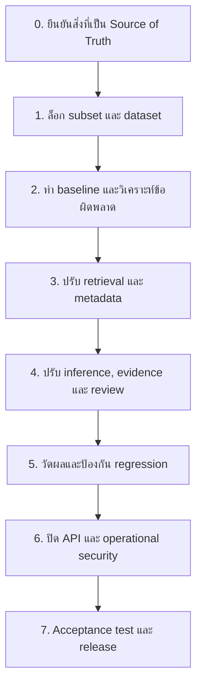

# แผนปิดโครงการให้ครบตามข้อกำหนด

> สถานะ 18 กันยายน 2026: ขั้น implementation และ numeric gates ดำเนินการแล้ว รวมถึงแก้ merge regression หลัง PR #6 รายละเอียดผลจริงอยู่ใน [PROJECT_COMPLETION_IMPLEMENTATION_TH.md](PROJECT_COMPLETION_IMPLEMENTATION_TH.md) และ [WORK_PLAN_TH.md](WORK_PLAN_TH.md) เอกสารนี้คงไว้เป็นแผนและเกณฑ์ ไม่ใช่สถานะ runtime ล่าสุด

สถานะดำเนินการล่าสุด 18 กันยายน 2026: ดู [สรุป implementation และสถานะแต่ละขั้น](PROJECT_COMPLETION_IMPLEMENTATION_TH.md)
ผล local ล่าสุด full-pack F1 97.30%, parent recall 97.30%, FPR 0% จึงผ่าน numeric quality gates แล้ว แต่ยังไม่ครบ Definition of Done เพราะยังรอ subset/gold-label approval และ independent semantic review

เอกสารนี้เป็นรายการทำงานตามลำดับเพื่อพาโครงการจาก baseline v0.2.0 ไปสู่สถานะที่ผ่านเกณฑ์สาธิตและพร้อมรับมอบตาม `security-alert-attack-technique-inference.md` ไม่ใช่คู่มือใช้งานระบบ

คำว่า **เสร็จ 100%** ในเอกสารนี้หมายถึง:

1. อยู่ในขอบเขตที่กำหนด: Enterprise ATT&CK 19.1, Windows/Linux, Initial Access, Execution และ Credential Access
2. ผลลัพธ์เลือกได้ 1–3 IDs จาก pinned subset เท่านั้น พร้อม tactic, confidence, evidence และ advisory disclaimer
3. Dataset/gold label และ subset ได้รับการยืนยันตามผู้สอน
4. Runtime evaluation ผ่าน Exact F1 ≥70%, parent recall ≥90%, hallucinated ID rate = 0 และ evidence grounding ≥85%
5. API/UI/guardrails/privacy/operational controls ผ่าน acceptance tests

สถานะเริ่มต้น ณ release v0.2.0: test ผ่าน 104 cases แต่ runtime full pack มี Exact F1 34.55%, parent recall 52.70%, false-positive rate 40%; evidence ปัจจุบันเป็น exact substring จึงยังไม่ใช่ semantic grounding

## ลำดับงานและเงื่อนไขก่อนเริ่ม



ห้ามข้ามขั้น 0–1 แล้วลด candidate หรือเปลี่ยน gold label เพื่อให้คะแนนดีขึ้น เพราะจะขัดกับข้อกำหนดและทำให้ผลประเมินเปรียบเทียบไม่ได้

## 0. ยืนยันขอบเขตที่ใช้ตัดสินผล

### สิ่งที่ต้องตัดสินใจกับผู้สอนหรือเจ้าของหลักสูตร

| ประเด็น | คำตอบที่ต้องบันทึก | เหตุผล |
| --- | --- | --- |
| Technique subset | รายชื่อ 30–50 IDs ที่อนุญาต หรืออนุมัติให้ใช้ 127 IDs | implementation ปัจจุบันมี 127 IDs แต่ specification ตั้งเป้าประมาณ 30–50 |
| Dataset composition | 35 alerts นับรวม multi-technique/ambiguous/negative อย่างไร | specification ระบุ 35 alerts และระบุ 10 ambiguous/multi-technique กับ 5 negative เพิ่มเติม จึงตีความได้มากกว่าหนึ่งแบบ |
| Gold labels | ผู้ตรวจ, วันที่, และการยืนยัน ID ต่อ narrative | dataset ปัจจุบันเป็น `1.0.0-rc1`, independent review ยัง pending |
| Parent credit | ยืนยันให้ parent ของ sub-technique ได้ 0.5 หรือค่าอื่น | evaluator ปัจจุบันใช้ 0.5 แต่ specification ระบุเพียง partial credit |
| Target environment | local course sandbox หรือ deployment จริง | เป็นตัวกำหนด auth, rate limiting, privacy/retention และ live-provider policy |

### วิธีทำ

1. สร้าง decision record ใน `docs/` หนึ่งไฟล์ ระบุวันที่ ผู้อนุมัติ ตัวเลือกที่เลือก และเหตุผล
2. เมื่อผู้สอนอนุมัติ subset ให้เก็บรายการ IDs ที่อนุมัติเป็นไฟล์ tracked แยกจาก generated allowlist
3. ให้ผู้ตรวจคนที่สองตรวจ `alert_id`, narrative และ `gold_technique_ids` ทุก record แล้วอัปเดต metadata ของ `data/eval/alerts-v1.0.json` เป็น version ที่ล็อกแล้ว
4. แก้ `data/eval/README.md`, `docs/WORK_PLAN_TH.md` และเอกสาร API ให้ใช้คำตอบเดียวกัน

### เกณฑ์ผ่าน

- ไม่มีข้อความ `pending_independent_review` หรือ `RC` ในสถานะ dataset ที่จะใช้รับมอบ
- subset ที่ retriever ใช้, allowlist ที่ ingestion สร้าง และ snapshot ใน evaluation ตรงกันทุก ID
- มีหลักฐานการอนุมัติที่ตรวจย้อนกลับได้

## 1. ทำ baseline ที่ทำซ้ำได้ก่อนปรับโมเดล

### วัตถุประสงค์

สร้างจุดเริ่มต้นที่ทุกคนรันเหมือนกันได้ เพื่อแยกให้ชัดว่าคะแนนเปลี่ยนเพราะการแก้ระบบ ไม่ใช่เพราะ STIX, dependency หรือ provider เปลี่ยน

### วิธีทำ

1. สร้าง virtual environment ด้วย Python 3.11 และติดตั้ง dependencies ตาม `requirements.txt`
2. รัน ingestion จาก `data/raw/enterprise-attack-19.1.json` เท่านั้น
3. รัน test, fixture evaluation และ runtime evaluation โดยกำหนด provider keys เป็นค่าว่าง
4. บันทึกผล runtime เป็น artifact ที่ไม่มี raw narrative เพิ่ม และบันทึก commit SHA, STIX version, dataset version, subset hash และ dependency versions
5. แยก development data ออกจาก locked evaluation data; ห้ามเปิด gold labels ของ evaluation set ระหว่างจูน rule

```bash
.venv/bin/python -m src.rag.ingest_stix
GOOGLE_API_KEY='' GEMINI_API_KEY='' .venv/bin/python -m pytest -q
GOOGLE_API_KEY='' GEMINI_API_KEY='' .venv/bin/python -m eval.run_eval --mode fixture --subset full
GOOGLE_API_KEY='' GEMINI_API_KEY='' .venv/bin/python -m eval.run_eval --mode runtime --subset full --output /tmp/runtime-baseline.json
git diff --check
git status --short
```

### ไฟล์ที่เกี่ยวข้อง

`src/rag/ingest_stix.py`, `eval/run_eval.py`, `eval/evaluator.py`, `eval/metrics.py`, `data/eval/`, `requirements.txt`

### เกณฑ์ผ่าน

- ทุกคนสร้าง KB เดียวกันจาก pinned STIX ได้
- test ผ่าน, fixture evaluation ผ่าน และ runtime evaluation มี report ที่ตรวจย้อนกลับได้
- evaluation ไม่มี network/provider call

## 2. วิเคราะห์ข้อผิดพลาดก่อนเขียน rule ใหม่

### วัตถุประสงค์

หาสาเหตุที่ F1 และ parent recall ต่ำโดยใช้ผลจริง แทนการเพิ่ม keyword แบบสุ่ม

### วิธีทำ

1. เพิ่มรายงานวิเคราะห์ที่ระบุต่อ `alert_id`: gold IDs, retrieved top-k, predicted IDs, evidence, `needs_human_review` และประเภทความผิดพลาด
2. แบ่ง error เป็นอย่างน้อย: router เลือก tactic ผิด, gold ไม่อยู่ใน top-k, inferencer ไม่เลือก candidate ที่ถูก, evidence/grounding ตัดผลที่ควรได้, benign/negation false positive, ambiguity ที่ไม่ส่ง review และ parent/sub-technique mismatch
3. สรุปจำนวนและสัดส่วนในตาราง แล้วจัดลำดับแก้ตามผลกระทบต่อ F1/FPR
4. เขียน test case ใหม่จาก pattern ที่พบลง development fixtures ก่อนแก้ implementation

### สิ่งที่ต้องระวัง

- ห้ามแก้ `gold_technique_ids` ให้ตรงกับ prediction
- ห้ามใช้ evaluation narratives เป็น keyword rules โดยตรง หากต้องจูน ให้สร้าง paraphrase หรือ development fixture ใหม่และเก็บ evaluation set ไว้เป็น blind set
- ต้องรายงาน no-match/negative controls แยกจาก positive examples

### เกณฑ์ผ่าน

- ทุก failure ใน baseline ถูกจัดประเภทได้
- มี development tests สำหรับ error class หลักทุกประเภท
- มี backlog ที่เชื่อม "ปัญหา → ไฟล์ที่จะเปลี่ยน → metric ที่คาดว่าจะดีขึ้น"

## 3. ปรับ Knowledge Base และ retrieval

### วัตถุประสงค์

ทำให้ candidate ที่ถูกต้องเข้าถึงได้ก่อน inferencer เลือก และทำให้ metadata ครบตาม milestone

### วิธีทำ

1. หลัง subset ได้รับอนุมัติ ให้เพิ่ม configuration หรือ tracked subset manifest แล้วให้ `src/rag/ingest_stix.py` กรองด้วย manifest นั้น
2. เก็บ metadata ที่จำเป็นของ candidate: tactics ทุกตัวที่เกี่ยวข้อง, platforms, source STIX object/reference และ description ที่เพียงพอสำหรับค้นหา โดยรักษา canonical `TechniqueCandidate` contract หรือเพิ่ม sidecar metadata ที่ไม่ทำให้ API แตก
3. ปรับ `src/rag/retriever.py` ให้ tokenization/normalization เหมาะกับ security terms เช่น `PowerShell`, `RDP`, `failed login`, encoded command และ sub-technique IDs
4. เพิ่ม weighted query จาก `ParsedAlert.observed_actions`, IOC และ narrative โดยไม่ทิ้ง narrative เดิม
5. วัด Recall@1, Recall@3 และ Recall@5 บน development set ทุกครั้งที่เปลี่ยน retrieval
6. เลือก top-k ที่มี recall สูงพอแต่ไม่เปิด candidate มากจน inferencer สับสน แล้วบันทึกค่า default ในเอกสาร

### ไฟล์หลัก

`src/rag/ingest_stix.py`, `src/rag/retriever.py`, `src/agents/tactic_specialists.py`, `src/agents/tactic_router.py`, `tests/test_ingest_stix.py`, `tests/test_retriever.py`

### เกณฑ์ผ่าน

- candidate ทุกตัวมาจาก approved pinned subset, ไม่ deprecated/revoked และมี STIX version 19.1
- retrieval deterministic เมื่อ input/configuration เท่ากัน
- baseline Recall@k และผลหลังแก้ถูกบันทึกแยก development/evaluation ชัดเจน
- ไม่มีการเปลี่ยน schema หรือ API โดยไม่อัปเดต tests และ contract

## 4. ปรับ inference, evidence และ human review

### วัตถุประสงค์

ลด false positive โดยเฉพาะ benign/negated alert และทำให้ผลที่ไม่แน่ใจถูกส่งให้ analyst ตรวจ

### วิธีทำ

1. แยกขั้น "พบคำ" ออกจากขั้น "ยืนยันความหมาย" ใน `technique_inferencer.py` และ `grounding_judge.py`
2. เพิ่ม detector สำหรับ negation และ benign context เช่น `no malicious activity`, `authorized`, `routine maintenance`, `patch management`, `training`, `simulation` โดยให้ผลเป็น no-match หรือ `needs_human_review=true` ตาม policy ที่ทดสอบได้
3. เพิ่ม ambiguity rules: เมื่อ evidence สนับสนุนหลาย Technique ใกล้เคียง, router ไม่แน่ใจ, score gap ต่ำ หรือ evidence อ่อน ให้ set review แทน confidence สูง
4. ปรับ confidence จากคะแนนที่สอบเทียบกับ development set ไม่ใช่เพียงจำนวนคำที่ตรง; กำหนด threshold และบันทึกเหตุผล
5. ให้ evidence linker ตรวจความสัมพันธ์ระหว่าง span กับ action ที่อ้าง ไม่ใช่เพียง substring อยู่ใน narrative
6. เพิ่ม tests สำหรับ injected prompt, malformed provider output, no-match, benign, negation, ambiguous, multi-technique, parent/sub-technique และ evidence ที่หลอกด้วยคำซ้ำ
7. หากใช้ LLM judge ให้จำกัด output ด้วย schema และ candidates ที่ retrieve มา, ใช้ prompt version ที่ tracked, ตั้ง timeout/retry และต้องมี deterministic fallback; ห้ามใช้ LLM สร้าง ID นอก candidate list

### ไฟล์หลัก

`src/agents/technique_inferencer.py`, `src/agents/evidence_linker.py`, `src/agents/grounding_judge.py`, `src/agents/alert_parser.py`, `src/agents/tactic_router.py`, `prompts/v1/`, `tests/test_agents.py`, `tests/test_inference_guardrails.py`

### เกณฑ์ผ่าน

- prediction ทุกตัวมี evidence ที่สัมพันธ์กับ action ไม่ใช่เพียงคำเดียวกัน
- benign/negated alerts ไม่ได้ Technique โดยไม่มีเหตุผล และกรณีกำกวมส่ง `needs_human_review=true`
- provider failure, malformed output หรือ timeout ไม่ทำให้เกิด fabricated ID/evidence
- confidence threshold ผ่าน calibration report บน development data

## 5. ทำ evaluation gates และป้องกัน regression

### วัตถุประสงค์

ยืนยันว่าการแก้แต่ละครั้งดีขึ้นจริง และไม่ทำให้ guardrails หลุด

### วิธีทำ

1. เพิ่ม test unit/integration สำหรับทุก bug ที่แก้ในขั้น 3–4
2. รัน development evaluation ระหว่างจูน แล้วรัน locked full evaluation เฉพาะ checkpoint ที่กำหนด
3. บันทึก F1, precision, recall, parent recall, Recall@k, tactic accuracy, evidence grounding, hallucinated ID rate, false-positive rate และ human-review rate ทุก checkpoint
4. ทำ CI ให้รัน ingestion → test → fixture smoke → runtime smoke ที่ปิด provider → whitespace check
5. ให้ `--require-quality-gates` ล้มเหลวเมื่อเกณฑ์หลักใดไม่ผ่าน และเก็บ report ที่ทำซ้ำได้จาก run สุดท้าย

### เกณฑ์รับมอบคุณภาพ

| Metric | เกณฑ์ |
| --- | ---: |
| Exact technique F1 | ≥70% |
| Parent technique recall | ≥90% |
| Hallucinated ID rate | 0 |
| Evidence grounding rate | ≥85% |
| False-positive rate | รายงานชัดเจนบน negative controls และมีเกณฑ์ที่ผู้สอนอนุมัติ |

หาก metric ยังไม่ผ่าน ให้ย้อนกลับไปแก้จาก error taxonomy ในขั้น 2 ไม่ใช่เปลี่ยน acceptance threshold หรือ gold label

## 6. ปิด API, lifecycle และ operational security

### วัตถุประสงค์

ทำให้ API ใช้งานได้อย่างปลอดภัยใน environment ที่ผู้สอน/เจ้าของระบบอนุมัติ

### วิธีทำ

1. เปลี่ยน retriever lifecycle จาก module import เป็น FastAPI lifespan/startup ที่ตรวจ KB ก่อนรับ traffic และคืน 503 ที่มี typed error เมื่อต้องการ KB แต่ไม่พร้อม
2. ทำให้ rebuild KB มีขั้นตอน atomic และกำหนดว่า server ต้อง reload/restart เมื่อ index เปลี่ยน เพื่อไม่ให้ taxonomy และ inference ใช้คนละ version
3. กำหนด total request deadline, provider timeout/retry และย้ายงาน synchronous ออกจาก event loop ตามรูปแบบที่เลือก
4. เพิ่ม authentication และ rate limiting ตาม target environment; ทดสอบกรณีไม่มีสิทธิ์และเกิน quota
5. กำหนด CORS allowlist ที่จำเป็นจริง ไม่ใช้ wildcard ใน deployment
6. สร้าง privacy policy สำหรับ alert text: consent ก่อนส่ง provider, redaction ของ IOC/ข้อมูลอ่อนไหวตามนโยบาย, retention period, วิธีลบ และสิทธิ์เข้าถึง log
7. ทำ structured logging ที่ไม่บันทึก narrative หรือ secret และมี request ID; เพิ่ม tests ยืนยันว่า error logs/responses ไม่สะท้อนข้อมูลอ่อนไหว
8. ตรึง dependency ด้วย lock file และบันทึก model/prompt/dataset/STIX versions ใน evaluation report

### ไฟล์หลัก

`src/api/main.py`, `src/api/routes/alerts.py`, `src/api/routes/rag.py`, `src/api/routes/evaluate.py`, `src/agents/gemini_client.py`, `requirements.txt`, `.github/workflows/ci.yml`, tests API และเอกสาร deployment/privacy ใหม่

### เกณฑ์ผ่าน

- API ไม่ล้มตอน import เมื่อ KB ยังไม่มี และตอบ error ที่ปลอดภัย
- timeout, provider outage, malformed input และ batch partial failure มีพฤติกรรมที่ทดสอบได้
- auth/rate limit/CORS/privacy ตรงกับ deployment decision ในขั้น 0
- ไม่มี secret, narrative ดิบ หรือ sensitive error detail หลุดใน repository, response หรือ log ที่กำหนด

## 7. ทำ acceptance test และเตรียมสาธิต

### วิธีทำ

1. ทดสอบ clean checkout บน Python 3.11: install → ingestion → tests → evaluation → run API/UI
2. ทำ browser E2E สำหรับ UI: input, loading, prediction cards, evidence, review/no-match, disclaimer และ error state
3. ทำ security acceptance: injection payload, overlong input, invalid technique IDs, missing KB, timeout, unauthorized/rate-limited request และ log redaction
4. ทำ demo ตามข้อกำหนด: brute force + PowerShell, top-5 candidates, benign patch-management ที่ no-match/review, evidence removal ที่ judge ปฏิเสธ และแสดง metrics
5. เก็บ release artifact: commit SHA, locked dependency file, STIX hash/version, subset manifest hash, dataset version/reviewer, prompt/model version, final evaluation report, test result และ known limitations ที่เหลือ (ถ้ามี)

### คำสั่งปิดงาน

```bash
.venv/bin/python -m src.rag.ingest_stix
GOOGLE_API_KEY='' GEMINI_API_KEY='' .venv/bin/python -m pytest -q
.venv/bin/python -m compileall -q src eval tests
GOOGLE_API_KEY='' GEMINI_API_KEY='' .venv/bin/python -m eval.run_eval --mode runtime --subset full --require-quality-gates --output /tmp/final-runtime-report.json
git diff --check
git status --short
```

### Definition of Done

- ทุกเกณฑ์ในตารางขั้น 5 ผ่านด้วย locked evaluation dataset
- ระบบสาธิตครบ 5 สถานการณ์ตาม specification โดยใช้ API/UI จริง
- API contract และ Pydantic schemas ยังเข้ากันได้
- ไม่มี Technique ID นอก pinned subset และผลมี advisory disclaimer เสมอ
- security/privacy controls ผ่านตาม target environment ที่อนุมัติ
- clean checkout ทำตามคำสั่งปิดงานได้ และ artifact ครบสำหรับตรวจซ้ำ

## สิ่งที่ไม่ควรทำเพื่อเร่งให้คะแนนผ่าน

- อย่าปรับ gold labels ตาม output ของระบบ
- อย่าฝังคำตอบของ evaluation alert เป็น keyword rule
- อย่าขยายไปทั้ง Enterprise Matrix, Mobile, ICS, malware หรือ PCAP เพราะอยู่นอก scope
- อย่าบังคับให้ provider ทำงานใน evaluation; runtime quality gate ต้องทำซ้ำได้แบบ offline
- อย่าปิด human review, evidence หรือ allowlist checks เพื่อให้ได้ prediction มากขึ้น
- อย่า deploy หรือส่ง alert จริงไป provider ก่อน privacy/consent/retention controls ได้รับอนุมัติ
