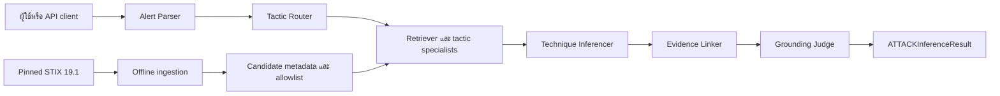

# คู่มือโครงการแบบละเอียด

เอกสารนี้อธิบายว่าโครงการทำอะไร ข้อมูลเดินทางอย่างไร วิธีติดตั้งและใช้งาน วิธีวัดผล และงานใดที่ยังต้องทำต่อ เป็นคู่มือสำหรับผู้อ่านที่ต้องการเข้าใจระบบก่อนแก้โค้ดหรือสาธิตงาน

เอกสารข้อกำหนดหลักคือ [security-alert-attack-technique-inference.md](../security-alert-attack-technique-inference.md) เสมอ หากเอกสารนี้ต่างจากข้อกำหนดหลัก ให้ยึดข้อกำหนดหลัก

## 1. โครงการนี้ทำอะไร

ระบบรับข้อความ Security Alert แล้วเสนอ MITRE ATT&CK Enterprise Technique ที่อาจสัมพันธ์กับเหตุการณ์ เช่น ข้อความที่ระบุการพยายามล็อกอิน RDP ล้มเหลวจำนวนมากและการรัน PowerShell อาจทำให้ระบบเสนอ `T1110` (Brute Force) และ `T1059.001` (PowerShell)

ผลลัพธ์หนึ่งรายการประกอบด้วย Technique ID, ชื่อ Technique, tactic, confidence, ข้อความหลักฐานที่พบใน alert, ลิงก์ MITRE และสถานะ `needs_human_review` ระบบเป็นเครื่องมือช่วยติดป้ายกำกับสำหรับนักวิเคราะห์ ไม่บล็อกเครื่อง ไม่กักกันไฟล์ และไม่ตอบสนองต่อเหตุการณ์โดยอัตโนมัติ

ผู้ใช้เป้าหมายคือ SOC Tier 1, ผู้ฝึก Threat Intelligence และ Detection Engineer ที่ต้องการตรวจความเชื่อมโยงระหว่างข้อความ alert กับ ATT&CK taxonomy

## 2. ขอบเขตและสิ่งที่ระบบไม่ทำ

ระบบทำงานกับ Enterprise ATT&CK STIX 2.1 รุ่นที่ตรึงไว้คือ `enterprise-attack-19.1` และค้นเฉพาะสาม tactics:

| Tactic | ตัวอย่างสิ่งที่เกี่ยวข้อง |
| --- | --- |
| Initial Access | วิธีที่ผู้โจมตีเข้าถึงระบบเป็นครั้งแรก |
| Execution | การเรียกใช้คำสั่งหรือโปรแกรม เช่น PowerShell |
| Credential Access | การได้มาหรือโจมตีข้อมูลรับรอง เช่น brute force |

Ingestion ปัจจุบันคัดเฉพาะ Windows/Linux และตัด technique ที่ deprecated หรือ revoked ออก ระบบจึงไม่ควรเสนอ ID นอก allowlist ที่สร้างจาก STIX ชุดนี้

ระบบไม่ครอบคลุม Mobile หรือ ICS ATT&CK, การวิเคราะห์ malware/PCAP, ATT&CK Enterprise ทั้งหมด และไม่พึ่ง TAXII ออนไลน์เพื่อให้คะแนน การส่ง alert จริงออกไปยังผู้ให้บริการ LLM ต้องผ่านนโยบาย sandbox และ privacy ก่อน

## 3. ภาพรวมการทำงาน



ลำดับนี้ทำให้แต่ละขั้นมีหน้าที่ชัดเจน และจำกัดการเลือก Technique ก่อนถึงขั้น inference:

1. **Alert Parser** รับ narrative และทำให้อยู่ใน `ParsedAlert` ซึ่งเก็บข้อความเดิม, asset, action และ IOC
2. **Tactic Router** เลือก tactic ที่น่าจะเกี่ยวข้องเพื่อให้ค้นหาแคบลง หาก provider ใช้ไม่ได้ fallback จะค้นทั้งสาม tactics ที่อยู่ในขอบเขต
3. **Technique Retriever** ใช้ BM25 จัดอันดับ candidate จาก knowledge base ที่สร้างไว้ และคืน top-k ตาม tactic
4. **Technique Inferencer** เลือกได้สูงสุด 3 IDs จาก candidates ที่ retriever คืนมาเท่านั้น
5. **Evidence Linker** เก็บเฉพาะ prediction ที่มี evidence span เป็นข้อความส่วนหนึ่งของ narrative จริง
6. **Grounding Judge** ตรวจเงื่อนไขเชิงโครงสร้าง เช่น ไม่มีผลลัพธ์, confidence ต่ำ, evidence หาย, candidate ไม่ตรง หรือข้อมูลซ้ำ แล้วกำหนดว่าต้องให้มนุษย์ทบทวนหรือไม่

## 4. Knowledge Base สร้างอย่างไร

ข้อมูลต้นทางอยู่ที่ `data/raw/enterprise-attack-19.1.json` ซึ่งเป็นไฟล์ STIX ที่ tracked ใน repository คำสั่ง ingestion อ่าน STIX แล้วกรอง tactic, platform และสถานะ deprecated/revoked ก่อนสร้างสองไฟล์ใน `data/processed/`:

| ไฟล์ที่สร้าง | ใช้ทำอะไร |
| --- | --- |
| `technique_ids.json` | allowlist ของ IDs ที่ระบบอนุญาตให้เสนอ |
| `technique_candidates.json` | metadata ที่ retriever ใช้ค้นหา เช่น ชื่อ, tactic, description excerpt และ STIX version |

ไฟล์ `data/processed/` ถูก ignore เพราะสร้างซ้ำได้ จึงต้องสร้างก่อนเปิด API หรือรันชุดทดสอบที่ import API route:

```bash
.venv/bin/python -m src.rag.ingest_stix
```

ผล ingestion ปัจจุบันมี 127 techniques (Initial Access 21, Execution 48, Credential Access 58) แม้ specification ตั้งเป้าประมาณ 30–50 techniques ดังนั้นต้องมีการตัดสินใจเรื่อง subset ร่วมกับทีม/ผู้สอนก่อน final demo ห้ามลดรายการตามการคาดเดา

## 5. วิธี inference ในโหมดต่าง ๆ

### โหมด offline

เมื่อไม่มี key หรือ evaluation ระบุ `use_provider=False` parser/router จะใช้ fallback ที่ปลอดภัย แล้ว inferencer ใช้กฎ lexical ร่วมกับ BM25 ผลลัพธ์ทำซ้ำได้เมื่อ input, candidate และ mode เหมือนเดิม และไม่มี network call

โหมดนี้เป็นวิธีที่ใช้ใน runtime evaluation เพื่อวัด pipeline ที่มีอยู่จริงโดยไม่ให้ key หรือ provider ทำให้ผลเปลี่ยน

### โหมด provider

เมื่อกำหนด `GOOGLE_API_KEY` หรือ `GEMINI_API_KEY` parser, router และ inferencer สามารถเรียก Gemini เพื่อให้ตอบ structured data ได้ ผลตอบกลับจาก provider ถือว่าไม่น่าเชื่อถือและต้องผ่าน Pydantic validation, candidate boundary และ evidence checks ก่อนคืน API response

การเปิด provider หมายความว่า narrative อาจออกจากเครื่อง จึงใช้เฉพาะข้อมูลที่นโยบายอนุญาต ห้ามใช้เพื่อข้าม guardrail หรือให้โมเดลสร้าง Technique ID เอง

## 6. โครงสร้างผลลัพธ์

Contract หลักคือ `ATTACKInferenceResult`:

```json
{
  "alert_id": "demo-001",
  "inferred_techniques": [
    {
      "technique_id": "T1059.001",
      "technique_name": "PowerShell",
      "tactic": "execution",
      "confidence": 0.75,
      "evidence_spans": ["execution of encoded PowerShell"],
      "mitre_url": "https://attack.mitre.org/techniques/T1059/001/"
    }
  ],
  "candidates_considered": [],
  "needs_human_review": true,
  "disclaimer": "Advisory tagging only. Not autonomous SOC action. Verify with senior analyst."
}
```

ค่า `confidence` อยู่ระหว่าง 0 และ 1 แต่ใน baseline ปัจจุบันยังไม่ผ่านการ calibration จึงใช้ตัดสินใจเองไม่ได้ `needs_human_review` เป็นสัญญาณให้ analyst ตรวจเพิ่ม ไม่ได้เป็นหลักฐานว่า prediction ถูกต้องหรือผิดแน่นอน

## 7. วิธีติดตั้งและเปิดระบบ

คำสั่งด้านล่างใช้ Python 3.11 และ virtual environment ที่มีอยู่ในโครงการ:

```bash
python3.11 -m venv .venv
.venv/bin/python -m pip install -r requirements.txt
.venv/bin/python -m src.rag.ingest_stix
GOOGLE_API_KEY='' GEMINI_API_KEY='' .venv/bin/python -m uvicorn src.api.main:app --reload
```

เปิด `http://127.0.0.1:8000/ui` สำหรับหน้าจอกรอก alert เดี่ยว หรือ `http://127.0.0.1:8000/docs` สำหรับ FastAPI interactive documentation

การตั้ง key ทั้งสองเป็นค่าว่างก่อนเปิด demo ช่วยป้องกันไม่ให้ค่าใน `.env` ถูกนำไปเรียก provider โดยไม่ตั้งใจ หลังสร้าง processed files แล้ว หากสร้างใหม่ระหว่าง server ทำงาน ต้อง restart server เพราะ retriever ถูกโหลดไว้ในหน่วยความจำ

## 8. วิธีเรียก API

| Endpoint | วิธีใช้ |
| --- | --- |
| `POST /alerts/infer` | วิเคราะห์ alert เดี่ยว |
| `POST /alerts/infer/batch` | วิเคราะห์ 1–25 alerts และคืนผลตามลำดับ input |
| `POST /rag/search` | ดู candidates ที่ BM25 ค้นได้ก่อน inference |
| `GET /taxonomy/techniques` | ดู Technique ทั้งหมดหรือกรองตาม tactic |
| `GET /taxonomy/techniques/{id}` | ดู candidate ราย ID จาก pinned subset |
| `POST /evaluate` | ประเมินจาก bundled dataset เท่านั้น |

ตัวอย่าง infer แบบ offline:

```bash
curl -X POST http://127.0.0.1:8000/alerts/infer \
  -H 'Content-Type: application/json' \
  -d '{"alert_id":"demo-001","narrative":"Encoded PowerShell commands were executed."}'
```

ตัวอย่างตรวจ retrieval โดยไม่ให้ inferencer เลือก ID:

```bash
curl -X POST http://127.0.0.1:8000/rag/search \
  -H 'Content-Type: application/json' \
  -d '{"narrative":"Encoded PowerShell commands were executed.","tactics":["execution"],"top_k":5}'
```

รายละเอียด payload, validation และ error อยู่ใน [API_OVERVIEW_TH.md](API_OVERVIEW_TH.md)

## 9. วิธีทดสอบและประเมินผล

### ทดสอบโค้ด

```bash
.venv/bin/python -m src.rag.ingest_stix
GOOGLE_API_KEY='' GEMINI_API_KEY='' .venv/bin/python -m pytest -q
git diff --check
git status --short
```

การตรวจล่าสุดผ่าน 104 tests ใน virtual environment การใช้ `python -m pytest` จาก system Python อาจล้มเหลวหากยังไม่ได้ติดตั้ง pytest จึงควรใช้ `.venv/bin/python` หรือ activate `.venv` ก่อน

### ประเมิน pipeline

```bash
.venv/bin/python -m eval.run_eval --mode fixture --subset iteration-2
.venv/bin/python -m eval.run_eval --mode runtime --subset iteration-2
.venv/bin/python -m eval.run_eval --mode runtime --subset full
.venv/bin/python -m eval.run_eval --mode runtime --require-quality-gates
```

`fixture` ทดสอบว่า metric และ runner คำนวณได้ถูกต้องจาก saved predictions จึงไม่ใช่คุณภาพโมเดลจริง ส่วน `runtime` เรียก pipeline offline จริงและปิด provider โดยเด็ดขาด Dataset เต็มมี 35 synthetic/sanitized alerts: positive 20, multi-technique 5, ambiguous 5 และ negative control 5 ข้อมูลยังเป็น `1.0.0-rc1` และรอผู้สอนหรือผู้ตรวจอิสระรับรอง gold labels

เกณฑ์ final demo ตาม specification คือ Exact F1 อย่างน้อย 70%, parent recall อย่างน้อย 90%, hallucinated-ID rate เท่ากับ 0 และ evidence grounding อย่างน้อย 85%

## 10. สถานะคุณภาพปัจจุบัน

ระบบทำงานครบเส้นทาง local แต่ยังไม่ผ่าน final-demo quality gates ผล runtime บน full course pack ที่รายงานใน `docs/PROJECT_REVIEW_TH.md` คือ Exact F1 34.55%, parent recall 52.70%, evidence grounding แบบ substring 100%, hallucinated ID 0% และ false-positive rate 40%

ผลบน release subset 10 รายการใน `eval_report.md` คือ F1 34.48%, parent recall 50.00% และ false-positive rate 50% ตัวเลขสองชุดใช้คนละชุดข้อมูล จึงไม่ควรนำมาเปรียบเทียบเป็นผล run เดียวกัน

ช่องว่างสำคัญคือ semantic grounding, การเข้าใจ negation/benign context/ambiguity, confidence calibration, เทคนิค subset ที่ยังเกินเป้าหมาย และการรับรอง gold labels

## 11. Security และข้อควรระวัง

- Treat ทุก alert และทุก provider response เป็น untrusted input ที่อาจมี prompt injection
- ห้ามเสนอ Technique ID ที่ไม่อยู่ใน retrieved candidates และ pinned allowlist
- ทุกคำตอบเป็น advisory ต้องให้ผู้เชี่ยวชาญตรวจผลก่อนใช้
- ห้าม commit `.env`, API key หรือ generated `data/processed/`
- การเปิด provider อาจส่ง narrative ออกนอกเครื่อง จึงต้องมี consent, redaction และ retention policy ก่อนใช้ข้อมูลจริง
- ระบบยังไม่มี authentication, rate limiting, retention enforcement, log-redaction assurance หรือ production security audit

## 12. งานที่ควรทำต่อ ตามลำดับ

1. ให้ผู้สอนยืนยัน technique subset, 35-alert composition, gold labels และสูตร parent partial credit
2. ใช้ runtime report วิเคราะห์ false positive/false negative โดยไม่แก้ gold label เพื่อให้คะแนนดีขึ้น
3. พัฒนา retrieval และ inferencer บน development data แยกจาก evaluation set พร้อมเพิ่ม semantic evidence, negation และ ambiguity checks
4. ทำ calibration ของ confidence และปรับเกณฑ์ `needs_human_review`
5. รัน runtime evaluation พร้อม `--require-quality-gates` จนผ่านทุกเกณฑ์
6. เพิ่ม authentication, rate limiting, privacy/retention, log redaction, KB startup lifecycle, deadline/concurrency และ acceptance/security tests ก่อน deploy หรือรับ alert จริง

## 13. แผนที่ไฟล์สำหรับเริ่มแก้ไข

| หากต้องการทำเรื่องนี้ | เริ่มอ่านไฟล์นี้ |
| --- | --- |
| ข้อกำหนดและขอบเขต | `security-alert-attack-technique-inference.md` |
| Pipeline หลัก | `src/inference_pipeline.py` |
| Parser, router, inference, evidence และ judge | `src/agents/` |
| STIX ingestion และ BM25 | `src/rag/ingest_stix.py`, `src/rag/retriever.py` |
| Data contract | `src/schemas.py` |
| API | `src/api/routes/` และ `docs/API_OVERVIEW_TH.md` |
| Metric และ evaluation | `eval/` และ `data/eval/README.md` |
| สถานะและงานคงเหลือ | `docs/WORK_PLAN_TH.md`, `docs/PROJECT_REVIEW_TH.md` |
| สถาปัตยกรรมเชิงลึก | `docs/architecture.md` |

ก่อนแก้ architecture, schema, API, dataset, evaluation หรือ security ให้กลับไปตรวจหัวข้อที่เกี่ยวข้องในข้อกำหนดหลักทุกครั้ง
