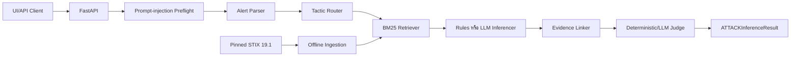

# คู่มือโครงการแบบละเอียด

อัปเดต 18 กันยายน 2026 หลัง merge PR #6 และแก้ merge regression โดยยึด [ข้อกำหนดหลัก](../security-alert-attack-technique-inference.md) เป็น Source of Truth

## 1. โครงการนี้ทำอะไร

ระบบรับ Security Alert แบบข้อความแล้วแนะนำ MITRE ATT&CK Enterprise Technique ที่สัมพันธ์กับพฤติกรรมใน Alert พร้อม tactic, support score, evidence spans, MITRE URL, candidates ที่พิจารณา และ `needs_human_review`

ระบบเป็น decision-support tool สำหรับ SOC Analyst ไม่บล็อกเครื่อง ไม่กักกันไฟล์ และไม่ตอบสนองเหตุการณ์อัตโนมัติ No-match หมายถึงไม่มีหลักฐานเพียงพอภายใต้ขอบเขตปัจจุบัน ไม่ใช่การรับรองว่าเหตุการณ์ปลอดภัย

## 2. ขอบเขตและฐานความรู้

- ใช้ pinned MITRE ATT&CK Enterprise STIX 2.1 รุ่น `enterprise-attack-19.1`
- กรอง Initial Access, Execution และ Credential Access บน Windows/Linux
- ตัด Technique ที่ deprecated หรือ revoked
- default snapshot ปัจจุบันมี provisional 127 IDs
- ข้อกำหนดตั้งเป้า subset ประมาณ 30–50 IDs จึงยังต้องให้ผู้สอนอนุมัติ manifest หรืออนุมัติข้อยกเว้น 127 IDs
- ไม่รองรับ Mobile/ICS ATT&CK, malware file, PCAP หรือ automated response

ไฟล์ต้นทางคือ `data/raw/enterprise-attack-19.1.json` และ runtime ใช้ `data/processed/kb_snapshot.json` ที่ ingestion publish แบบ atomic พร้อม compatibility exports สำหรับเครื่องมือเดิม

## 3. ภาพรวมสถาปัตยกรรม



1. API ตรวจ request, auth/rate limit/body/deadline และเลือก inference mode
2. Pipeline ตรวจ prompt injection ก่อน Parser หรือ provider
3. Parser คง narrative ต้นฉบับและแยก asset/action/IOC เมื่อ provider ทำได้
4. Router จำกัด tactics; เมื่อไม่แน่ใจเปิดครบสาม tactics
5. Retriever ใช้ deterministic BM25, allowlist, tactic filter และ behavior reranking
6. Inferencer เลือกได้เฉพาะ retrieved candidates สูงสุด 3 Techniques
7. Pipeline ตรวจ ID, name, tactic, URL, duplicate และจำนวนผล
8. Evidence Linker ตรวจ span กับ narrative และบริบท
9. Judge ปฏิเสธผลที่ไม่มีหลักฐานหรือส่งกรณีไม่แน่ใจให้มนุษย์

ไฟล์ `src/agents/tactic_specialists.py` เป็นโค้ดประกอบจากงานรุ่นก่อน แต่ pipeline canonical ปัจจุบันเรียก `BaselineRetriever.search()` โดยตรงตาม Source of Truth

## 4. โหมด inference

### Offline / Rules

- เป็นค่าเริ่มต้น
- ไม่เรียก external provider แม้ process มี API key
- Parser/Router ใช้ conservative fallback
- Retriever ใช้ BM25 และ behavior reranking
- `technique_inferencer.py` ใช้ `behavior-rules-v3`
- UI แสดง `RULE SUPPORT SCORE`
- เป็นโหมดที่ใช้คำนวณ full-set numeric quality gates

### Gemini

ใช้ `gemini-3.5-flash-lite` กับ Parser, Router, LLM Inferencer และ LLM Grounding Judge

### OpenRouter

ใช้ `OPENROUTER_MODEL` ซึ่งมีค่าเริ่มต้น `openrouter/free` กับ LLM stages ชุดเดียวกัน และตั้ง `provider.data_collection=deny`

Online mode ต้องมี server-side key และ `PROVIDER_CONSENT=reviewed-synthetic-only` หาก provider ล้มเหลว ระบบไม่สลับ provider อื่นอย่างเงียบ ๆ แต่ใช้ conservative Offline result พร้อม fallback reason และ human review

## 5. Security และ privacy

- Alert และ provider output เป็น untrusted input
- instruction-like prompt injection ถูก block ก่อนเรียกโมเดล
- Technique ต้องอยู่ใน retrieved candidates และ pinned allowlist
- ใช้ Pydantic ตรวจ schema และช่วงคะแนน
- ตรวจ metadata และ MITRE URL ก่อนเผยแพร่ผล
- Online prompt ผ่าน redaction ขั้นต้นสำหรับ IPv4, email และ labeled secrets
- Redaction ไม่ครอบคลุมข้อมูลอ่อนไหวทุกชนิด จึงอนุญาตเฉพาะ reviewed synthetic alerts
- UI ไม่ใช้ localStorage/sessionStorage
- Structured logs ไม่เก็บ narrative, alert ID, query หรือ traceback
- ผลลัพธ์ทุกครั้งมี disclaimer และ human-review policy

Operational controls ใน course sandbox ได้แก่ optional API key, per-IP/process rate limit, explicit CORS origins, body limit, 60-second default deadline และ bounded worker pool 4 งาน Production หลาย instance ยังต้องมี TLS, gateway auth, trusted-proxy policy และ distributed controls

## 6. สร้าง Knowledge Base

```bash
.venv/bin/python -m src.rag.ingest_stix
```

Ingestion ตรวจ pinned SHA-256, subset manifest เมื่อมี, tactic/platform และ revoked/deprecated ก่อนสร้าง snapshot Runtime โหลด snapshot ครั้งเดียวตอน FastAPI startup และตรวจกลับกับ raw STIX หลัง ingestion ต้อง restart server

## 7. เปิดระบบ

Offline demo:

```bash
GOOGLE_API_KEY='' GEMINI_API_KEY='' \
  .venv/bin/python -m uvicorn src.api.main:app \
  --host 127.0.0.1 --port 8000 --no-access-log
```

Online synthetic demo:

```bash
.venv/bin/python -m uvicorn src.api.main:app \
  --host 127.0.0.1 --port 8000 --no-access-log --env-file .env
```

ตรวจ `/ready` ก่อนเปิด `/ui` หาก KB ไม่พร้อม routes ที่ใช้ KB จะตอบ typed 503 แต่ liveness `/` ยังทำงาน

## 8. API contract

| Endpoint | หน้าที่ |
| --- | --- |
| `GET /` | Liveness และ STIX version |
| `GET /ready` | Readiness และ subset status |
| `GET /ui` | Analyst Workspace |
| `POST /alerts/infer` | วิเคราะห์ Alert เดี่ยว |
| `POST /alerts/infer/batch` | วิเคราะห์ 1–25 Alerts ตามลำดับ |
| `POST /rag/search` | ตรวจ top-k candidates |
| `GET /taxonomy/techniques` | List/filter taxonomy |
| `GET /taxonomy/techniques/{id}` | Candidate ราย ID |
| `POST /evaluate` | Offline bundled evaluation |

รายละเอียด request, headers, errors และ limits อยู่ใน [API_OVERVIEW_TH.md](API_OVERVIEW_TH.md)

## 9. ผลลัพธ์และคะแนน

`ATTACKInferenceResult` มี `alert_id`, `inferred_techniques`, `candidates_considered`, `needs_human_review` และ `disclaimer`

ฟิลด์ `confidence` ใน API แสดงบน UI เป็น Rule Support Score หรือ LLM Support Score คะแนนยังไม่ calibrated จึงไม่ใช่เปอร์เซ็นต์โอกาสที่คำตอบถูก

## 10. Evaluation ปัจจุบัน

ชุดประเมินเต็มมี synthetic alerts 35 รายการ: positive 20, multi-technique 5, ambiguous 5 และ negative 5

ผล Offline `behavior-rules-v3` หลัง merge-fix:

| Metric | ผล |
| --- | ---: |
| Exact F1 | 97.30% |
| Parent recall | 97.30% |
| Evidence grounding | 100% |
| Hallucinated ID rate | 0% |
| Negative-control FPR | 0% |
| Recall@5 | 100% |

Grounding 100% เป็น verbatim/behavior-rule validation ไม่ใช่ independent semantic correctness ส่วน Gemini/OpenRouter strict full-set attempts ยัง incomplete เพราะ provider rate limit จึงไม่มีการนำ Offline fallback มาปนเป็นคะแนน LLM

## 11. การทดสอบและ acceptance

```bash
.venv/bin/python -m pytest -q
.venv/bin/python -m eval.run_eval --mode runtime --subset full \
  --diagnostics --require-quality-gates
PLAYWRIGHT_BROWSERS_PATH=/tmp/security-alert-browsers \
  .venv/bin/python scripts/browser_acceptance.py
.venv/bin/python scripts/demo_acceptance.py
git diff --check
git status --short
```

ผล local หลังแก้ merge regression: 207 tests ผ่าน, UI build ผ่าน, demo acceptance ผ่าน, browser acceptance ผ่าน และ Offline numeric gates ผ่าน

## 12. สถานะที่ยังไม่ปิด

1. ผู้สอนยังต้องอนุมัติ subset 30–50 IDs หรืออนุมัติข้อยกเว้น 127 IDs
2. Gold labels และ dataset composition ยังรอ independent approval
3. Semantic grounding และ score calibration ยังไม่ผ่านผู้ตรวจอิสระ
4. LLM full-set metrics ยังไม่ครบ
5. Production deployment controls อยู่นอกขอบเขต local sandbox

ดังนั้น `acceptance_ready` ยังเป็น `false` แม้ numeric gates ผ่าน

## 13. แผนที่ไฟล์

| หัวข้อ | ไฟล์หลัก |
| --- | --- |
| Source of Truth | `security-alert-attack-technique-inference.md` |
| Schemas | `src/schemas.py` |
| FastAPI/controls | `src/api/main.py`, `src/api/routes/` |
| Pipeline | `src/inference_pipeline.py` |
| Agents/guardrails | `src/agents/` |
| Retrieval/ingestion | `src/rag/` |
| Evaluation | `eval/`, `data/eval/` |
| Analyst UI | `ui/src/App.tsx` |
| Deployment/privacy | `docs/DEPLOYMENT_PRIVACY_TH.md` |
| Current status | `docs/WORK_PLAN_TH.md`, `docs/PROJECT_COMPLETION_IMPLEMENTATION_TH.md` |
