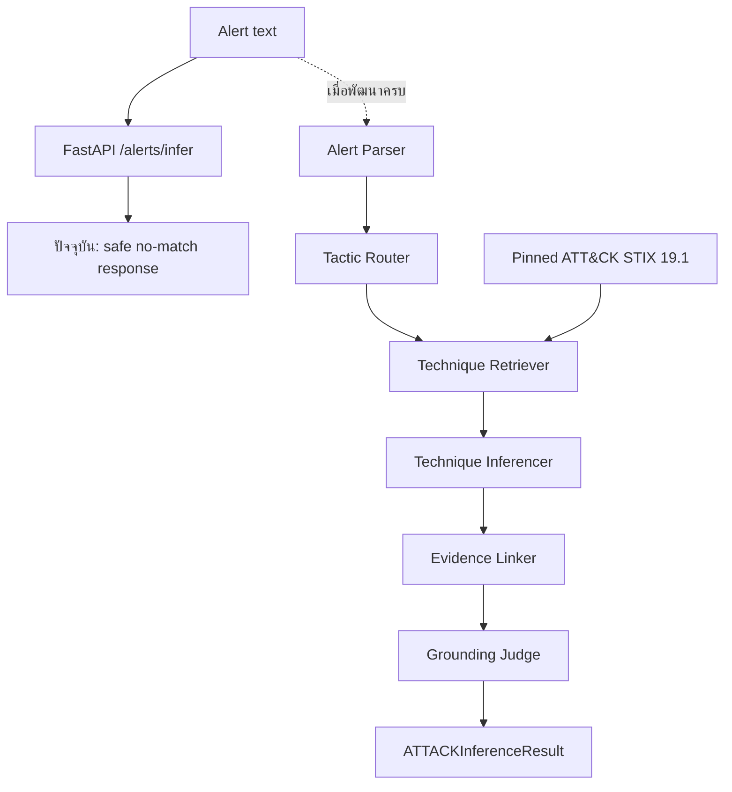

# คู่มืออ่านโปรเจกต์ Security-Alert

เอกสารนี้เป็นลำดับการอ่านสำหรับคนที่เพิ่งเข้ามาในโครงการ เพื่อเข้าใจเป้าหมาย สถานะปัจจุบัน โค้ดที่ทำงานแล้ว และงานที่ยังเหลืออยู่

## สรุปในหนึ่งนาที

Security-Alert รับข้อความ security alert แล้วมีเป้าหมายจะแนะนำ MITRE ATT&CK Enterprise Technique 1–3 รายการ พร้อม confidence, tactic และ evidence spans ให้ analyst ตรวจสอบต่อ

ปัจจุบัน repository มี knowledge base ที่กรองจาก MITRE STIX, Pydantic schemas และ FastAPI taxonomy endpoints แล้ว สาย B มี inferencer, evidence linker และ grounding judge ที่ทดสอบได้แล้ว แต่ retrieval, evaluation และการเชื่อม pipeline เข้ากับ API ยังอยู่ระหว่างพัฒนา ดังนั้น `POST /alerts/infer` ยังคืน no-match แบบปลอดภัยและตั้ง `needs_human_review: true` เสมอ

## ลำดับการอ่านที่แนะนำ

### 1. เข้าใจเป้าหมายและกติกาก่อน

อ่าน [security-alert-attack-technique-inference.md](../security-alert-attack-technique-inference.md) ซึ่งเป็น Source of Truth ของโครงการ โดยเริ่มจากหัวข้อต่อไปนี้:

| หัวข้อ | สิ่งที่ต้องเข้าใจ |
| --- | --- |
| 1 และ 3 | ปัญหา เป้าหมาย In Scope และ Out of Scope |
| 4 | ใช้ MITRE Enterprise ATT&CK STIX 2.1 รุ่นตรึง `enterprise-attack-19.1` |
| 5 | pipeline เป้าหมายของ agents |
| 6 | Pydantic schemas และชื่อ field ที่ API ต้องใช้ |
| 8 | API contract เป้าหมาย |
| 9 | metrics และ quality gates |
| 10 | security guardrails ที่ห้ามละเมิด |

กติกาสำคัญ: ระบบเป็น advisory เท่านั้น, ห้ามสร้าง Technique ID เอง, ใช้เฉพาะ subset ที่ตรึงไว้ และถือว่า alert text เป็น untrusted input

### 2. ดูวิธีรันและขอบเขต MVP

อ่าน [README.md](../README.md) เพื่อดู environment, dependencies, วิธีรัน test และวิธีเปิด FastAPI ในเครื่อง

```bash
conda run -n sec-alert311 python -m pytest -q
conda run -n sec-alert311 python -m uvicorn src.api.main:app --reload
```

เมื่อรันแล้ว เปิด Swagger UI ที่ `http://127.0.0.1:8000/docs`

### 3. เช็กว่างานเดินถึงขั้นไหน

อ่าน [WORK_PLAN_TH.md](WORK_PLAN_TH.md) ซึ่งเป็นสถานะงานล่าสุด แล้วดู [TEAM_WORK_PARALLEL_PROPOSAL_TH.md](TEAM_WORK_PARALLEL_PROPOSAL_TH.md) สำหรับหน้าที่และจุดส่งต่องานของแต่ละสาย

สถานะปัจจุบันโดยย่อ:

| ส่วน | สถานะ |
| --- | --- |
| STIX ingestion และ pinned subset | ทำแล้ว |
| Schemas และ taxonomy API | ทำแล้ว |
| `/alerts/infer` | เป็น safe no-match stub |
| Retriever / RAG | กำลังพัฒนาโดยสาย A |
| Inference, evidence และ grounding | พร้อมส่งต่อให้ D เชื่อมระบบ |
| Evaluation | กำลังพัฒนาโดยสาย C |
| API integration, CI และ UI | กำลังพัฒนาโดยสาย D |

### 4. ดูภาพรวม API ก่อนอ่าน routes

อ่าน [API_OVERVIEW_TH.md](API_OVERVIEW_TH.md) เพื่อดู Mermaid diagram ของ client → FastAPI → inference pipeline และ endpoint เป้าหมายทั้งหมด

จากนั้นอ่าน [architecture.md](architecture.md) เพื่อเปรียบเทียบ architecture ปัจจุบันแบบ walking skeleton กับ target architecture

### 5. อ่านโค้ดตามเส้นทางข้อมูล

อ่านตามลำดับนี้:

```text
src/schemas.py
  → src/rag/ingest_stix.py
  → src/api/main.py
  → src/api/routes/taxonomy.py
  → src/api/routes/alerts.py
```

| ไฟล์ | หน้าที่ |
| --- | --- |
| `src/schemas.py` | นิยาม `ParsedAlert`, `TechniqueCandidate`, `InferredTechnique` และ `ATTACKInferenceResult` |
| `src/rag/ingest_stix.py` | กรอง STIX ให้เหลือ tactics และ platforms ใน scope; ตัด deprecated/revoked |
| `src/api/main.py` | สร้าง FastAPI app, register routes และเพิ่ม MITRE version header |
| `src/api/routes/taxonomy.py` | list/detail API ของ Technique จาก processed candidates |
| `src/api/routes/alerts.py` | endpoint infer ปัจจุบัน ซึ่งยังไม่เรียก pipeline จริง |

`src/agents/technique_inferencer.py`, `evidence_linker.py` และ `grounding_judge.py` พร้อมใช้งานเป็นโมดูลสาย B แล้ว; `src/rag/embedder.py`, `src/rag/retriever.py` และ API integration คือส่วนที่ยังต้องส่งมอบ/เชื่อมต่อในลำดับถัดไป

### 6. อ่าน tests ควบคู่กับโค้ด

```text
tests/test_schemas.py
tests/test_ingest_stix.py
tests/test_taxonomy_api.py
tests/test_alerts_api.py
tests/test_agents.py
tests/test_inference_guardrails.py
```

tests บอกพฤติกรรมที่ระบบรับประกันได้แล้วในปัจจุบัน เช่น format ของ Technique ID, การกรอง STIX, taxonomy endpoints, ผล no-match ของ `/alerts/infer` และ guardrails ของสาย B

## ภาพรวมเส้นทางข้อมูลปัจจุบันและเป้าหมาย



## ประเด็นที่ต้องจำให้แม่น

- ข้อมูลหลักของ taxonomy คือ `data/raw/enterprise-attack-19.1.json`; processed candidates และ allowlist อยู่ใน `data/processed/`
- field ที่ใช้ใน candidate และ prediction คือ `tactic: str` ไม่ใช่ `tactics`
- prediction ต้องเลือกจาก retrieved candidates เท่านั้น และมีได้ 1–3 IDs ต่อ alert
- evidence span ต้องเป็นข้อความที่พบจริงใน narrative
- no-match, low confidence หรือผลกำกวมต้องตั้ง `needs_human_review: true`
- ห้ามให้ tests เรียก Gemini หรือ network จริง

## ถ้าจะเริ่มพัฒนาต่อ

ทำตาม [WORK_PLAN_TH.md](WORK_PLAN_TH.md) และแบ่งงานใน [TEAM_WORK_PARALLEL_PROPOSAL_TH.md](TEAM_WORK_PARALLEL_PROPOSAL_TH.md): A ปิด retriever, C ปิด evaluation, D เชื่อม API โดยเรียกโมดูล B ที่พร้อมอยู่แล้ว
