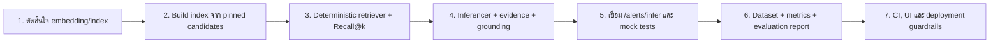

# รายงานรีวิวโครงการ Security-Alert

วันที่ตรวจ: 24 สิงหาคม 2026

ขอบเขตการตรวจ: เอกสาร โค้ด ข้อมูล processed และ automated tests ใน branch `mai-work`

ข้อกำหนดอ้างอิงหลัก: `security-alert-attack-technique-inference.md` (MITRE Enterprise ATT&CK STIX 2.1 `enterprise-attack-19.1`)

## บทสรุป

โปรเจกต์มี **walking skeleton ที่ปลอดภัยและทดสอบได้** สำหรับส่วนฐานข้อมูล MITRE ATT&CK และ API taxonomy แต่ยัง **ไม่ใช่ระบบอนุมาน ATT&CK ที่ทำงานจริง**. `POST /alerts/infer` รับและตรวจรูปแบบ Alert ได้ ทว่าเจตนาคือคืน no-match เสมอพร้อมส่งให้มนุษย์ตรวจ จึงไม่เรียก Gemini และไม่เดา Technique โดยไม่มีหลักฐาน

สิ่งที่ทำเสร็จแล้วสอดคล้องกับฐานรากของแผนงาน: schema, ingestion ของ STIX ที่ตรึงเวอร์ชัน, allowlist และ taxonomy API. ส่วนที่ยังไม่ทำคือ retrieval/index, inference/evidence/grounding, endpoint ตาม API contract ที่เหลือ, evaluation, CI และ UI/deployment. ดังนั้นสถานะที่ถูกต้องคือ **Foundation เสร็จเป็นส่วนใหญ่; Retrieval และ pipeline จริงยังไม่เริ่ม**.

ผลตรวจ ณ วันที่รายงาน:

```text
python -m pytest -q  ->  17 passed in 0.16s
git diff --check     ->  ผ่าน
git status --short   ->  ไม่มีไฟล์เปลี่ยนแปลงก่อนเริ่มเขียนรายงานนี้
```

ไฟล์ processed มี candidate 127 รายการ และ allowlist 127 ID; ทุก candidate อยู่ใน allowlist และใช้ STIX version `19.1`:

| Tactic | จำนวน candidate |
| --- | ---: |
| `credential-access` | 58 |
| `execution` | 48 |
| `initial-access` | 21 |

## สิ่งที่ระบบทำได้ในปัจจุบัน

```mermaid
flowchart LR
    A[Client / SOC analyst] -->|POST /alerts/infer| B[FastAPI + Pydantic validation]
    B --> C[Deterministic no-match]
    C --> D[ATTACKInferenceResult]
    D --> E[Human review = true]
    F[Pinned STIX 19.1] --> G[Ingestion]
    G --> H[127 technique candidates + allowlist]
    H --> I[GET /taxonomy/techniques]
    H --> J[GET /taxonomy/techniques/{id}]
```

เส้นทางด้านบนแยกเป็นสองส่วน: API inference ยังเป็น stub เพื่อความปลอดภัย ส่วน taxonomy API อ่านผลจาก ingestion ที่สร้างเสร็จแล้ว. ทั้งสองส่วนยังไม่เชื่อมกันเป็น RAG pipeline.

## คำอธิบายโค้ดรายส่วน

### Schema: `src/schemas.py`

เป็นสัญญาข้อมูลกลางด้วย Pydantic และตอนนี้ใช้ชื่อฟิลด์ `tactic: str` ตรงตาม specification แล้ว.

| Model | หน้าที่ | การตรวจสอบที่มี |
| --- | --- | --- |
| `ParsedAlert` | แทน Alert ที่แยก narrative, asset, action และ IOC | บังคับ field ตามชนิดข้อมูล |
| `TechniqueCandidate` | Technique จาก knowledge base สำหรับให้ retriever พิจารณา | ตรวจ ID รูปแบบ `T####`/`T####.###` |
| `InferredTechnique` | Prediction ที่ต้องส่งให้ผู้ใช้ | ตรวจ ID และ confidence ให้อยู่ในช่วง 0–1 |
| `ATTACKInferenceResult` | response หลักของ `/alerts/infer` | บังคับ alert ID, predictions, candidates, review flag และ disclaimer |

ข้อดีคือ validation ของ ID และ confidence ป้องกัน output โครงสร้างผิดระดับหนึ่ง. ข้อจำกัดคือ schema เพียงอย่างเดียวไม่ได้ยืนยันว่า ID อยู่ใน allowlist, prediction อยู่ใน candidate ที่ค้นมา หรือ evidence เป็นข้อความย่อยของ narrative; การยืนยันเหล่านี้ต้องอยู่ใน pipeline/grounding judge ซึ่งยังไม่มี.

### Knowledge base ingestion: `src/rag/ingest_stix.py`

โมดูลนี้แปลง STIX bundle ที่ตรึงไว้จาก `data/raw/enterprise-attack-19.1.json` เป็นข้อมูลใช้งานของ MVP.

1. `load_stix_objects()` อ่านรายการ STIX objects จาก bundle.
2. `external_id()` ดึง ATT&CK ID จาก reference ที่มี `source_name = mitre-attack`.
3. `in_scope()` คัดเฉพาะ object ประเภท `attack-pattern` ที่ไม่ deprecated/revoked, มี tactic ใน `initial-access`, `execution`, หรือ `credential-access`, และรองรับ Windows หรือ Linux.
4. `to_candidate()` สร้าง `TechniqueCandidate`; หาก technique อยู่ได้หลาย tactic จะเลือก tactic ในขอบเขตที่เรียงตามตัวอักษรเป็นค่าเดียวอย่าง deterministic.
5. `main()` เขียน `technique_ids.json` (allowlist) และ `technique_candidates.json` ลง `data/processed/`.

ผลนี้ตรงกับ guardrail สำคัญ: ไม่ให้ใช้ revoked/deprecated technique และยึด pinned STIX `19.1`. จุดที่ควรระวังคือ candidate เก็บ tactic ได้เพียงค่าเดียว แม้ STIX ต้นทางอาจผูกหลาย tactic; ข้อตกลงนี้ระบุอยู่ใน `WORK_PLAN_TH.md` และ consumer ในอนาคตต้องยอมรับข้อจำกัดดังกล่าว.

### RAG: `src/rag/embedder.py` และ `src/rag/retriever.py`

ทั้งสองไฟล์ว่าง จึงยังไม่มี embedding backend, index หรือการค้นหา top-k. นี่เป็นช่องว่างหลักที่ทำให้ระบบยังจับคู่ Alert กับ Technique ไม่ได้ และยังไม่มี Recall@k baseline.

### Agent ที่เตรียมไว้: `src/agents/`

| ไฟล์ | สิ่งที่โค้ดทำ | สถานะใช้งาน |
| --- | --- | --- |
| `gemini_client.py` | อ่าน `GOOGLE_API_KEY` หรือ `GEMINI_API_KEY`, สร้าง Google GenAI client แล้วส่ง prompt | helper ที่ยังไม่มี timeout/retry/error normalization |
| `alert_parser.py` | ส่ง narrative ให้ Gemini แยก assets, actions และ IOCs เป็น `ParsedAlert`; บังคับ narrative ใน output ให้เท่าข้อความต้นฉบับ | ยังไม่ถูกเรียกจาก API; parse JSON แบบเปราะเมื่อ model ตอบผิดรูปแบบ |
| `tactic_router.py` | ขอให้ Gemini เลือก tactic ใน 3 ค่า; กรองค่าที่อยู่นอก scope และ fallback ไปค้นทั้งสาม tactic | ยังไม่ถูกเรียกจาก API; ยังไม่มี structured-output enforcement หรือ test |
| `technique_inferencer.py` | ไม่มีโค้ด | ยังไม่ทำ |
| `evidence_linker.py` | ไม่มีโค้ด | ยังไม่ทำ |
| `grounding_judge.py` | ไม่มีโค้ด | ยังไม่ทำ |

โค้ด parser/router แสดงทิศทางที่ตั้งใจไว้ แต่ไม่ควรเปิดใช้ในสภาพนี้: Alert เป็น untrusted input ตาม specification, ข้อความถูกต่อเข้ากับ prompt โดยตรง และยังไม่มี guardrail สำหรับ prompt injection, timeout, retry, typed error หรือ mock test. การที่ API ปัจจุบันไม่เรียกโค้ดชุดนี้จึงเป็นสถานะที่ปลอดภัยกว่า.

### FastAPI: `src/api/`

`src/api/main.py` สร้างแอป FastAPI, โหลด `.env`, register routes และเติม header `X-MITRE-ATTaCK-Version: enterprise-attack-19.1` ให้ทุก response เพื่อ attribution/version traceability. `GET /` เป็น health check.

| Endpoint | พฤติกรรมปัจจุบัน | สถานะเทียบ specification |
| --- | --- | --- |
| `GET /` | คืน `status` และ STIX version | มีเพิ่มจาก contract เพื่อ health check |
| `GET /taxonomy/techniques` | โหลด processed candidates และ filter แบบ exact match ด้วย `tactic` ได้ | ทำแล้ว |
| `GET /taxonomy/techniques/{id}` | ค้นแบบไม่สนตัวพิมพ์; ไม่พบคืน 404 | ทำแล้ว |
| `POST /alerts/infer` | validate `alert_id`/`narrative`, สร้าง ID หากไม่ส่งมา, คืน lists ว่างและ `needs_human_review=true` | เป็น safe stub ยังไม่ infer |
| `POST /alerts/infer/batch` | ไม่มี | ยังไม่ทำ |
| `POST /rag/search` | ไม่มี | ยังไม่ทำ |
| `POST /evaluate` | ไม่มี; `evaluate.py` ว่างและไม่ได้ register route | ยังไม่ทำ |

`main.py` เปิด CORS ทุก origin (`*`). เหมาะกับการพัฒนาเฉพาะที่ แต่ต้องจำกัด origin และเพิ่ม authentication/rate limit ก่อน deploy ตามแผน Week 6.

### Prompts, evaluation และ UI

มีไฟล์ prompt เวอร์ชัน `v1` สำหรับ parser/router/inferencer/grounding judge ซึ่งเป็นจุดเริ่มต้นที่ดีสำหรับ prompt versioning แต่ยังไม่มีโค้ดใน inferencer/judge ใช้จริง. `eval/metrics.py` และ `eval/run_eval.py` ว่าง, ไม่มี evaluation dataset ที่ใช้งานได้ใน `data/eval`, และ `ui/` ว่าง. ดังนั้นยังวัด Exact F1, parent recall, grounding rate, hallucinated-ID rate หรือ false-positive rate ไม่ได้ และยังไม่มีหน้าจอสำหรับ analyst.

## การทดสอบที่มีและสิ่งที่ยังขาด

17 tests ปัจจุบันครอบคลุม:

- schema ขั้นต้นของ `TechniqueCandidate`;
- logic คัด STIX ตาม tactic/platform/deprecated/revoked และการเขียน processed files ด้วย fixture;
- health/header, taxonomy list/filter/detail/404 และกรณี processed file ไม่มี;
- `/alerts/infer` ที่ต้องคืน no-match และ human-review flag.

สิ่งที่ยังไม่มีคือ test ของ parser/router/Gemini, retriever, allowlist enforcement จาก end-to-end inference, evidence span, grounding judge, batch/search/evaluate endpoints, malformed/timeout/provider error, prompt injection, metrics และ evaluation dataset. Test ที่ผ่านจึงยืนยันฐานรากและ safe stub ได้ แต่ยังไม่ใช่หลักฐานว่าโมเดล infer ATT&CK ได้ถูกต้อง.

## ช่องว่างและความเสี่ยงตามลำดับความสำคัญ

| ระดับ | ประเด็น | ผลกระทบ | แนวทางที่ควรทำ |
| --- | --- | --- | --- |
| สูง | ไม่มี retrieval, inferencer, evidence linker และ grounding judge | เป้าหมายหลักคือคืน 1–3 technique พร้อม evidence ยังทำไม่ได้ | ปิด Week 2–3 ตามลำดับ: deterministic retriever ก่อน แล้วจึงสร้าง inference/grounding |
| สูง | `/alerts/infer` ยังเป็น stub และสาม endpoint ตาม API contract ยังไม่มี | client ใช้ workflow ตาม specification ครบไม่ได้ | เชื่อม pipeline แบบ mockable แล้วเพิ่ม batch, search และ evaluate เมื่อ component พร้อม |
| สูง | Gemini path ยังไม่มี guardrails เชิงปฏิบัติการ | เสี่ยง prompt injection, output ผิดรูปแบบ และ failure ที่คาดเดาไม่ได้เมื่อเปิดใช้ | แยก untrusted alert ออกจากคำสั่ง, validate structured output, timeout/retry, typed errors และ mock tests |
| สูง | ไม่มี evaluation pack/metrics | ยืนยัน quality gate ของ F1, recall, grounding และ hallucination rate ไม่ได้ | สร้าง dataset ตามจำนวน/ประเภทที่ specification กำหนดและ runner ที่ทำซ้ำได้ |
| กลาง | ไม่มี CI, lock file และ reproducible retrieval decision | ผลทดสอบ/ผล retrieval อาจเปลี่ยนตาม environment หรือ dependency | เลือก backend/index, บันทึก decision, pin/lock dependencies และทำ CI smoke test |
| กลาง | CORS เปิดกว้าง, ไม่มี auth/rate limit/request ID/logging/privacy policy | ยังไม่พร้อม deploy หรือรับ Alert จริง | ทำ controls ตาม deployment model ใน Week 6; ห้ามส่ง raw alert ออกนอก course sandbox |
| ต่ำ | taxonomy โหลด JSON ใหม่ทุก request และ filter tactic ไม่ validate | ยังไม่กระทบ MVP ขนาดเล็ก แต่ scaling/error UX จำกัด | cache หลังมี lifecycle ที่ชัดเจน และคืน 422 สำหรับ tactic ที่ไม่รองรับหากเป็น contract ที่ทีมตกลง |

## แผนทำงานที่แนะนำ



1. บันทึก decision ของ embedding backend, metadata/index format และขั้นตอน rebuild; ต้องใช้ `data/processed` และ allowlist ที่ตรึงไว้เท่านั้น.
2. ทำ retriever ที่กำหนด top-k, filter tactic และมีผลเรียงลำดับซ้ำได้; เพิ่ม test allowlist/determinism พร้อม Recall@1/@3/@5 baseline.
3. ทำ inferencer ให้เลือกได้เฉพาะ retrieved candidates; evidence linker ต้องยืนยันว่า spans ปรากฏจริงใน narrative; grounding judge ต้อง reject candidate/ID/evidence ที่ไม่ผ่านและตั้ง human review ในกรณีเสี่ยง.
4. เชื่อม pipeline เข้ากับ `/alerts/infer` ด้วย interface ที่ mock ได้ แล้วเพิ่ม API contract ที่ขาดโดยไม่เรียก provider จริงใน test.
5. สร้าง evaluation pack ตาม specification (35 alerts, 10 ambiguous/multi-technique, 5 negative controls), metrics และ report ที่เก็บ STIX/model/prompt/dataset versions.
6. ก่อน deploy จึงทำ CI, CORS allowlist, authentication/rate limiting ตาม environment, request ID/logging, privacy/retention, UI และ acceptance/security tests.

## ข้อสรุปการรับมอบ

โครงการพร้อมเป็นฐานสำหรับพัฒนา MVP ต่อ: STIX subset, schema และ taxonomy API มีหลักฐานทดสอบ และ safe no-match behavior ไม่ละเมิดข้อห้ามเรื่องการสร้าง ATT&CK ID เอง. อย่างไรก็ตาม ยังไม่ควรนำเสนอว่าเป็นระบบ ATT&CK inference สำเร็จรูปหรือใช้ประเมิน quality gate จนกว่าจะมี retrieval, evidence grounding, evaluation และ deployment guardrails ตามรายการข้างต้น.
