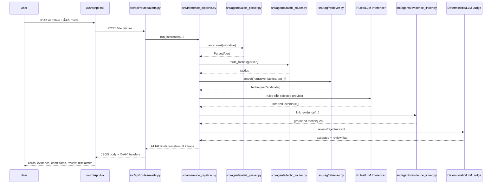

# คู่มือการทำงานของระบบตามลำดับไฟล์และโค้ด

อัปเดต 17 กันยายน 2026 เอกสารนี้อธิบายว่าแต่ละขั้นรับข้อมูลจากไฟล์ใด ทำอะไร และส่งต่อไปยังโค้ดใดจนจบทั้งระบบ โดยยึด schema/API/guardrails จากข้อกำหนดหลัก

## แผนที่รวม

## 0. สร้างฐานความรู้ก่อนเปิดระบบ

### Input

- `data/raw/enterprise-attack-19.1.json`
- optional `data/subset/approved.json`

### โค้ด

`src/rag/ingest_stix.py`

1. `load_stix_objects()` อ่าน STIX objects
2. `in_scope()` กรอง tactics/platform และ revoked/deprecated
3. `to_candidate()` แปลงเป็น `TechniqueCandidate`
4. `metadata_for()` สร้าง sidecar metadata เช่น tactics, platforms, source refs และ full description
5. `atomic_json()` publish snapshot โดยไม่ทิ้งไฟล์ครึ่งเดียว

### Output และขั้นถัดไป

สร้าง `data/processed/kb_snapshot.json` พร้อม compatibility exports แล้ว `src/api/runtime.py:load_knowledge_base()` จะโหลดตอน FastAPI startup

## 1. เปิด FastAPI และโหลด snapshot

### โค้ด

- `src/api/main.py:create_app()` สร้าง app, middleware, CORS และ routers
- lifespan เรียก `src/api/runtime.py:load_knowledge_base()`
- `load_knowledge_base()` สร้าง `BaselineRetriever` และตรวจ version/hash/IDs/metadata เทียบ pinned STIX

### ส่งต่อ

เก็บ retriever ที่ `app.state.retriever` และให้ routes ขอผ่าน `get_retriever()` `/ready` ใช้ข้อมูลนี้ตัดสิน readiness

## 2. ผู้ใช้กรอก Alert ใน UI

### โค้ด

`ui/src/App.tsx`

ผู้ใช้กรอก narrative, optional alert ID และเลือก `offline`, `gemini` หรือ `openrouter` UI ส่ง `POST /alerts/infer` โดยไม่ส่ง API key ของ provider จาก browser

### ส่งต่อ

JSON ไปที่ `src/api/routes/alerts.py:infer_techniques()` และ UI รอทั้ง response body กับ `X-AI-*` headers

## 3. Middleware และ request validation

### โค้ด

`src/api/main.py:controls()`

- ตรวจ/สร้าง request ID
- ตรวจ `X-API-Key` เมื่อ server ตั้งค่า
- จำกัด per-IP rate และ body 600 KB
- ตั้ง total deadline, security/cache headers และ safe structured log

จากนั้น `src/api/routes/alerts.py:AlertRequest` ตรวจ narrative, alert ID, extra fields และ inference mode

### ส่งต่อ

`infer_techniques()` เรียก `run_bounded()` เพื่อส่ง `_run_alert()` เข้า bounded thread pool โดยส่ง request, retriever และ trace dict

## 4. Route เรียก pipeline

### โค้ด

`src/api/routes/alerts.py:_run_alert()`

- แปลง `inference_mode` เป็น `use_provider` และชื่อ provider
- เรียก `src/inference_pipeline.py:run_inference()`
- เก็บ trace สำหรับสร้าง response headers
- จับ error แล้วคืน typed/safe behavior ตาม API contract

### ส่งต่อ

Pipeline รับ `alert_id`, narrative, retriever, top-k, mode/provider และ mutable trace

## 5. Alert Parser

### Offline

`src/agents/alert_parser.py:parse_alert()` ใช้ fallback ที่คง narrative ต้นฉบับและ annotations ว่าง

### Online

`parse_alert()` สร้าง prompt ที่แยก untrusted payload แล้วเรียก `ProviderChain.generate_text()` ผ่าน Gemini/OpenRouter ผลต้องเป็น JSON ที่ validate เป็น `ParsedAlert`; malformed output fallback อย่างปลอดภัย

### ส่งต่อ

คืน `ParsedAlert(narrative, assets, observed_actions, iocs)` ให้ Pipeline แล้วส่ง object นี้ต่อ `route_tactics()`

## 6. Tactic Router

### โค้ด

`src/agents/tactic_router.py:route_tactics()`

- Offline/fallback: ใช้ครบสาม tactics เพื่อไม่ตัด candidate ที่ถูกจาก classification error
- Online: provider คืน tactics ที่ต้องอยู่ใน `IN_SCOPE_TACTICS` เท่านั้น

### ส่งต่อ

Pipeline ส่ง narrative, tactics, observed actions และ IOCs ไป `BaselineRetriever.search()`

## 7. Technique Retriever

### โค้ด

`src/rag/retriever.py:BaselineRetriever.search()`

- กรอง allowlist และ tactics
- tokenize/normalize query และ full MITRE descriptions
- BM25 จัดอันดับ
- behavior reranking ช่วยยก candidate ที่มี action/context รองรับ
- คืน top-k (ค่าเริ่มต้น 5) แบบ deterministic เมื่อ input/snapshot เท่ากัน

### ส่งต่อ

คืน `list[TechniqueCandidate]` ให้ Pipeline เพื่อใช้เป็นขอบเขตสูงสุดของ Inferencer

## 8A. Offline Technique Inferencer

### โค้ด

- `src/agents/technique_inferencer.py:infer_techniques()`
- `src/agents/behavior.py:support()/evidence()`

ตรวจ action, benign context, negation, ambiguity และ technique-specific patterns เลือกเฉพาะ candidates สูงสุด 3 รายการ สร้าง `InferredTechnique` พร้อม rule support score และ verbatim evidence

### ส่งต่อ

ส่ง proposed techniques ไป guard validation ใน Pipeline แล้วต่อ Evidence Linker

## 8B. Online LLM Technique Inferencer

### โค้ด

- `src/agents/llm_technique_inferencer.py:infer_with_llm()`
- prompt version `candidate-inference-v1`
- `src/agents/provider_chain.py:ProviderChain`
- `src/agents/gemini_client.py` หรือ `src/agents/openrouter_client.py`

Prompt ส่ง candidate IDs และ evidence segments ที่มีหมายเลข LLM ต้องคืนไม่เกิน 3 IDs, confidence และ `evidence_ids` ระบบ validate JSON, duplicates, candidate membership, confidence และ evidence context แล้ว map IDs กลับ verbatim spans

หากไม่ผ่านจะ fallback ไป Offline Inferencer และตั้ง review/fallback reason

### ส่งต่อ

ส่ง proposed LLM techniques ไป guard validation และ Evidence Linker เช่นเดียวกับ Offline

## 9. Guard validation ใน Pipeline

### โค้ด

`src/inference_pipeline.py:run_inference()`

ก่อน grounding ตรวจทุก prediction ว่า:

- ID อยู่ใน retrieved candidates
- name/tactic ตรง candidate
- MITRE URL สร้างจาก ID ถูกต้อง
- ไม่มี duplicate และไม่เกิน 3 รายการ

รายการผิดถูกตัดและทำให้ต้อง human review

### ส่งต่อ

รายการที่ผ่านไป `src/agents/evidence_linker.py:link_evidence()`

## 10. Evidence Linker

### โค้ด

`link_evidence()` ตรวจว่า span อยู่ใน narrative จริง ไม่ใช่ substring ที่ไร้สาระ และสำหรับ rules path ต้องผ่าน contextual behavior validation จาก `behavior.py`

### ส่งต่อ

คืน grounded techniques ให้ deterministic Grounding Judge

## 11. Grounding Judge

### Deterministic

`src/agents/grounding_judge.py:judge_result()` ตรวจ unknown/mismatch, no-match, confidence ต่ำกว่า policy threshold, injection/ambiguity และ candidate competition แล้วตัดสินว่าต้อง review หรือไม่

### Online semantic judge

หากมี grounded LLM proposals Pipeline เรียก `src/agents/llm_grounding_judge.py:semantic_judge()` ซึ่งรับได้เฉพาะ `accept`, `reject`, `review` ต่อ ID ที่เสนอ หาก provider/Judge ล้มเหลว ระบบไม่ปล่อย unreviewed LLM proposal แต่กลับไป conservative rules result

### ส่งต่อ

Pipeline รวม accepted techniques กับ review flags เป็น canonical result

## 12. สร้าง response และ UI แสดงผล

### Schema

`src/schemas.py:ATTACKInferenceResult`

- `alert_id`
- `inferred_techniques`
- `candidates_considered`
- `needs_human_review`
- `disclaimer`

### Provider diagnostics

`src/api/routes/alerts.py` แปลง trace เป็น `X-AI-*` headers โดยไม่เปลี่ยน response schema และไม่ส่ง raw exception/secret

### UI

`ui/src/App.tsx` render technique cards, evidence, candidates, score source, provider stage status, fallback reason, review banner และ disclaimer

## 13. RAG/Taxonomy endpoints

- `src/api/routes/rag.py:search_candidates()` ใช้ retriever เดียวกันเพื่อ inspect top-k
- `src/api/routes/taxonomy.py` list/get candidates จาก snapshot เดียวกับ inference
- ทั้งสองผ่าน middleware, auth/rate limit/deadline และ typed KB errors

## 14. Evaluation flow

### API dashboard

UI เรียก `src/api/routes/evaluate.py:evaluate_dataset()` ซึ่งส่งงานไป `eval/evaluator.py:create_report(mode="runtime")` Provider ถูกปิดเสมอ

### CLI

`eval/run_eval.py` validate dataset/predictions/allowlist แล้วเรียก `create_report()`:

1. `runtime_predictions()` เรียก pipeline ต่อ alert
2. `eval/metrics.py` คำนวณ precision/recall/F1, parent recall, grounding, hallucination, FPR, human review และ Recall@k
3. `eval/diagnostics.py` จัด error classes และเก็บ offsets/hash
4. Report บันทึก commit/code/dataset/STIX/prompt/model/dependency hashes และ quality gates

โหมด `llm` บังคับ provider success ทุก stage หาก fallback หลัง retry จะหยุดและไม่คำนวณ partial metrics

## 15. Acceptance และ release evidence

- `scripts/demo_acceptance.py` ตรวจ demo 5 ขั้นผ่าน ASGI client
- `scripts/browser_acceptance.py` เปิด Chromium และตรวจ UI/API จริง
- `scripts/verify_clean.py` ทำ clean-copy install → ingestion → tests → evaluations
- `scripts/release_manifest.py` รวม hashes, test summary, numeric gates และ blockers
- `.github/workflows/ci.yml` รัน ingestion/tests/evaluation/browser jobs ใน CI

ผลล่าสุด: 199 tests ผ่าน, Offline full-set gates ผ่าน, browser/demo/clean-copy ผ่าน แต่ final acceptance ยังรอ gold/subset และ independent review

## ไฟล์ที่ควรเปิดตามลำดับเมื่อตรวจโค้ด

1. `security-alert-attack-technique-inference.md`
2. `src/schemas.py`
3. `src/api/main.py`
4. `src/api/routes/alerts.py`
5. `src/inference_pipeline.py`
6. `src/agents/alert_parser.py`
7. `src/agents/tactic_router.py`
8. `src/rag/retriever.py`
9. `src/agents/technique_inferencer.py` และ `llm_technique_inferencer.py`
10. `src/agents/evidence_linker.py`
11. `src/agents/grounding_judge.py` และ `llm_grounding_judge.py`
12. `ui/src/App.tsx`
13. `eval/evaluator.py` และ `eval/metrics.py`
