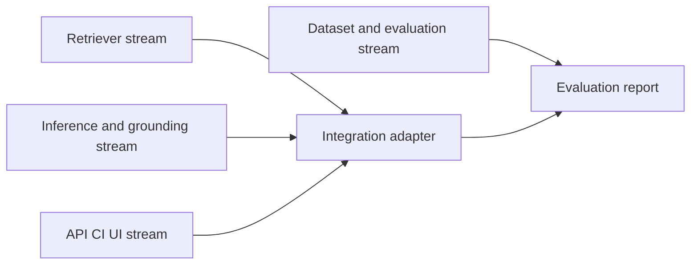

# แผนแบ่งงานแบบทำพร้อมกัน: Security-Alert

สถานะ: **เอกสารแบ่งงานที่ใช้งานอยู่**

อ้างอิงหลัก: `security-alert-attack-technique-inference.md`

## สถานะการทำงานล่าสุด (1 กันยายน 2026)

| สายงาน | สถานะ | จุดส่งต่องานถัดไป |
| --- | --- | --- |
| A — Retrieval | baseline เชื่อมแล้ว | BM25 deterministic retrieval ใช้กับ API แล้ว; platform/source metadata และ subset decision ยังเหลือ |
| B — Inference, evidence และ guardrails | baseline เชื่อมแล้ว | pipeline เรียก infer/evidence/judge แล้ว; semantic grounding ยังเหลือ |
| C — Dataset และ evaluation | กำลังทำ | ส่ง gold dataset, metrics และ reproducible report |
| D — API, CI และ UI | กำลังทำ | `/alerts/infer` เชื่อม A+B แล้ว; batch/search, typed errors, CI และ UI ยังเหลือ |

ไฟล์ `TEAM_WORK_BREAKDOWN_TH.md` ถูกยกเลิกและลบออกแล้ว; เอกสารนี้เป็นแหล่งอ้างอิงเดียวสำหรับการแบ่งงานสี่สาย

## หลักการของแผน

แผนเดิมแบ่งตามลำดับ runtime ของ pipeline คือ Parser/Router → Retriever → Inferencer → Judge → API. ลำดับนี้ถูกต้องเมื่อตัวระบบทำงานจริง แต่ทำให้การพัฒนาต้องรอคนก่อนหน้าส่งโค้ดและเกิดรอบ merge หลายครั้ง

แผนนี้แยกงานเป็น 4 สายที่ทดสอบได้ด้วย fixture หรือ fake adapter ของตนเอง. แต่ละสายทำงานอิสระได้ แล้วเหลือการเชื่อมของจริงเพียงครั้งเดียวหลังแต่ละสายผ่าน test ของตัวเอง



## หลักการที่ห้ามเปลี่ยน

- ใช้ Enterprise ATT&CK STIX `enterprise-attack-19.1` ที่ตรึงไว้ และใช้เฉพาะ ID ใน `data/processed/technique_ids.json`.
- Candidate และ prediction ใช้ `tactic: str` ตาม Pydantic schema ปัจจุบัน.
- Prediction ต้องเลือกจาก candidate ที่ได้รับเท่านั้น, มี 1–3 IDs, และ `evidence_spans` ต้องพบจริงใน narrative.
- Alert คือ untrusted input; test ต้อง mock provider และห้ามเรียก Gemini จริง.
- ผลลัพธ์เป็น advisory เท่านั้น: คง disclaimer, MITRE attribution และ `needs_human_review`.
- ไม่มีสายงานใดเพิ่ม automated response, Mobile/ICS ATT&CK หรือ online TAXII เป็น dependency หลัก.

## ข้อตกลงร่วมระหว่างทำงาน

ให้ทีมยืนยันข้อตกลงต่อไปนี้ก่อน integration เพื่อให้ทั้งสี่สายส่งมอบงานได้โดยไม่เปลี่ยน schema หรือ behavior กลาง:

| เรื่องที่ล็อก | ข้อตกลงปัจจุบัน |
| --- | --- |
| Fixture กลาง | มี narrative 10 ตัวอย่าง, candidate lists, allowlist, expected no-match และ prediction ที่ตั้งใจให้ผิดสำหรับทดสอบ judge/metrics |
| Candidate ordering | score จากมากไปน้อย แล้วเรียง `technique_id` เพื่อแก้คะแนนเท่ากัน |
| No-match | `inferred_techniques=[]`, `needs_human_review=true`, disclaimer ตาม schema |
| Provider failure | ไม่ส่ง exception หรือ secret ถึง client; คืน safe no-match/review หรือ typed HTTP error ที่ทีมตกลง |
| Evidence | exact substring ของ narrative ใน MVP แรก |
| Test policy | unit/integration tests ห้ามเรียก network หรือ Gemini จริง |

ให้เก็บ fixture กลางเป็นข้อมูลจำลองที่ sanitize แล้ว เช่น `tests/fixtures/`; ผู้ดูแล fixture เปลี่ยนผ่าน PR เล็กแยกต่างหากเพื่อหลีกเลี่ยง conflict. แต่ละสายสามารถคัดลอก fixture ขั้นต่ำไว้ใน test ของตัวเองได้ระหว่างรอ merge โดยต้องปรับกลับมาใช้ fixture กลางก่อนส่งงาน.

## สายงาน A — Retrieval foundation

> สถานะ: implementation baseline ส่งมอบและเชื่อมแล้ว; ส่วน metadata platform/source และการยืนยัน scope 127 candidates เป็นงานค้าง

**เป้าหมาย:** คืน top-k `TechniqueCandidate` จาก pinned subset แบบ deterministic โดยยังไม่ต้องพึ่ง parser หรือ Gemini

| หัวข้อ | รายละเอียด |
| --- | --- |
| Input ที่ใช้ทดสอบ | narrative string, tactic ที่ระบุเองหรือ `None` สำหรับค้นทุก tactic ใน scope, `top_k` |
| Fake dependency | ไม่ต้องมี; ใช้ `data/processed/technique_candidates.json` และ allowlist โดยตรง |
| ไฟล์หลัก | `src/rag/embedder.py`, `src/rag/retriever.py`, `tests/test_retriever.py`, decision note ของ backend/index |
| ไม่แตะ | API routes, agents, evaluation data, UI |
| ส่งมอบ | keyword/BM25 baseline, tactic filter, deterministic ranking, allowlist enforcement, tests และผล Recall@1/@3/@5 จาก fixture |

ข้อเสนอสำหรับ MVP คือเริ่มจาก keyword/BM25 ที่ rebuild ได้ในเครื่องก่อน แล้วค่อยตัดสินใจเพิ่ม embedding เมื่อมี baseline และ dependency ที่ตรึงได้. Retrieval service ควรรับ narrative โดยตรง เพื่อไม่ให้ Parser/Router เป็น critical path.

## สายงาน B — Inference, evidence และ guardrails

> สถานะ: implementation baseline ส่งมอบและเชื่อมแล้ว; evidence ยังตรวจแบบ structural exact substring ไม่ใช่ semantic grounding

**เป้าหมาย:** แปลง candidate ที่ฉีดเข้ามาเป็น prediction ที่ grounded โดยไม่ต้องรอ retriever จริง

| หัวข้อ | รายละเอียด |
| --- | --- |
| Input ที่ใช้ทดสอบ | narrative + `list[TechniqueCandidate]` จาก fixture |
| Fake dependency | fake Gemini/provider ที่คืน valid JSON, malformed JSON, timeout, prompt injection และ invalid ID |
| ไฟล์หลัก | `src/agents/technique_inferencer.py`, `src/agents/evidence_linker.py`, `src/agents/grounding_judge.py`, helper provider ที่จำเป็น, `tests/test_inference_guardrails.py` |
| ไม่แตะ | retriever, API routes, eval runner, UI |
| ส่งมอบ | เลือกได้เฉพาะ candidate ที่รับมา, 1–3 results, evidence exact substring, confidence/review rules และ unit tests |

Parser และ Tactic Router ให้ถือเป็นงานเสริมในสายนี้ ไม่ใช่ตัวบล็อก MVP: ทำ unit test ได้โดย mock provider แต่ integration รอบแรกอนุญาตให้ส่ง narrative เข้า retriever ตรง ๆ. Judge ต้อง reject ID นอก candidates/allowlist, tactic ไม่ตรง, evidence ไม่พบ, no-match, low confidence และผลกำกวม.

## สายงาน C — Dataset และ evaluation

**เป้าหมาย:** สร้างเครื่องมือวัดคุณภาพที่ใช้ saved predictions ได้ จึงไม่ต้องรอ retriever หรือ LLM

| หัวข้อ | รายละเอียด |
| --- | --- |
| Input ที่ใช้ทดสอบ | gold dataset และ JSON predictions ที่เขียนไว้เป็น fixture |
| Fake dependency | ไม่มี provider; ใช้ synthetic saved predictions สำหรับทุก metric |
| ไฟล์หลัก | `data/eval/`, `eval/metrics.py`, `eval/run_eval.py`, `tests/test_metrics.py`, dataset README/version record |
| ไม่แตะ | agents, retriever, API routes, UI |
| ส่งมอบ | 35 alerts, 10 ambiguous/multi-technique, 5 negative controls, metrics และ reproducible report |

Metric ขั้นต่ำคือ Exact technique F1, parent technique recall, evidence grounding rate, hallucinated-ID rate, false-positive rate, human-review rate และ Recall@1/@3/@5. Gold IDs ทุกตัวต้องตรวจกับ pinned allowlist และให้สมาชิกอีกอย่างน้อยหนึ่งคน review labels ก่อนล็อก dataset version.

## สายงาน D — Product shell: API, CI และ UI

**เป้าหมาย:** เติม product surface รอบถัดไปบน pipeline จริงที่เชื่อมแล้ว โดยคง tests ให้ใช้ fixture/mock และไม่เรียก provider จริง

| หัวข้อ | รายละเอียด |
| --- | --- |
| Input ที่ใช้ทดสอบ | `ATTACKInferenceResult` และ pipeline/retriever fixture สำหรับ success, no-match, invalid provider result และ timeout |
| Fake dependency | mock provider หรือ test double เฉพาะจุด; ห้ามเรียก Gemini/network จริง |
| ไฟล์หลัก | `src/api/`, API tests, CI workflow, `ui/`, documentation ของ error behavior |
| ไม่แตะ | algorithm ใน `src/rag/`, rule implementation ใน agents, dataset/metrics |
| ส่งมอบที่เหลือ | batch endpoint, search endpoint, request ID/typed safe errors, CI smoke test และ UI skeleton |

UI ของ MVP แสดง narrative, prediction, confidence, evidence, candidate list และ human-review status; ข้อมูลต้องแสดง disclaimer เสมอ. CORS/auth/rate limit ให้เลือกตาม deployment target และไม่เปิดใช้กับข้อมูล Alert จริงก่อนกำหนด privacy/retention policy.

## การรวมงาน: ทำครั้งเดียวและมีเจ้าภาพชัดเจน

การ integration A+B เข้ากับ `/alerts/infer` ทำแล้วบน `mai-work`; ลำดับ runtime ปัจจุบันคือ:

```text
API request
→ parser(narrative) → router(parsed alert)
→ retriever(narrative, tactic=tactics, top_k)
→ inferencer(narrative, candidates)
→ evidence validation and grounding judge
→ ATTACKInferenceResult
```

ระหว่าง integration ห้ามเปลี่ยน schema หรือ fixture โดยไม่มี PR แยก. ถ้าส่วนหนึ่งยังไม่พร้อม ให้คง fake implementation ของส่วนนั้นไว้และทำ contract test ต่อ; ไม่ควรทำให้ทั้ง API หรือ evaluation หยุดรอ.

## Definition of Done รายสาย

| สาย | เสร็จเมื่อ |
| --- | --- |
| A | top-k ซ้ำได้, ทุก ID อยู่ allowlist, tactic filter/no-match ถูกต้อง และมี Recall@k baseline |
| B | malformed/timeout/prompt injection ไม่สร้าง prediction ที่ไม่ grounded; evidence และ candidate constraints ผ่าน tests |
| C | dataset ครบตามจำนวน/ประเภท, metrics ให้ผลตาม saved fixtures, report ระบุ dataset/STIX/prompt/model version |
| D | contract ของ API ใช้ได้กับ fake pipeline, tests ไม่เรียก provider จริง, CI ผ่าน และ UI แสดง advisory result ได้ |
| Integration | ผล end-to-end ผ่าน schema/allowlist/evidence tests และสามารถรัน evaluation runner ได้ |

## ประเด็นให้ทีมตัดสินใจ

1. จะใช้ keyword/BM25 เป็น retrieval baseline หรือมี embedding backend ที่ทีมยอมรับเรื่อง dependency และ reproducibility แล้วหรือไม่
2. MVP แรกจะให้ tactic เป็น optional filter และค้นทั้งสาม tactic เมื่อไม่มั่นใจหรือไม่
3. Provider failure จะคืน HTTP error แบบใด หรือคืน safe no-match เสมอ
4. ใครเป็นเจ้าภาพ fixture กลาง และใครเป็นผู้ review gold labels คนที่สอง
5. UI/deployment รอบนี้ต้องไปถึงระดับใด: local demo เท่านั้น หรือมี environment จริงที่ทำให้ต้องทำ auth/rate limit/privacy controls ครบ

## ข้อสรุป

แผนนี้ยังคง architecture และ guardrails ตาม specification แต่เปลี่ยนวิธีจัดงานจากการส่งต่อโค้ดเป็นการส่งต่อ contract ที่ทดสอบได้. ผลคือทั้งสี่คนเริ่มพร้อมกันได้, ลดไฟล์ที่แก้ทับกัน, และเหลือ dependency จริงไว้เฉพาะ integration รอบท้าย.
