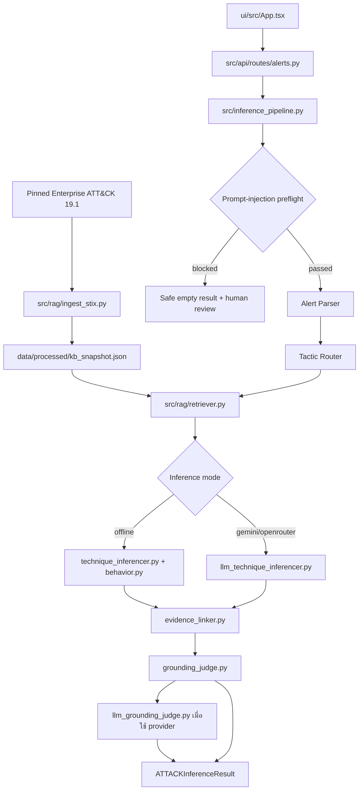

# สถาปัตยกรรมปัจจุบัน

อัปเดต 18 กันยายน 2026 หลัง merge PR #6 และแก้ merge regression อ้างอิงข้อกำหนดหลักหัวข้อ Agent Architecture, Data Schemas, Knowledge Base, API Contract และ Security & Guardrails

## ภาพรวม

ระบบมีสามเส้นทางที่ใช้แกนกลางเดียวกัน:

- **Offline / Rules** — BM25 + `behavior-rules-v3`; เป็นโหมดค่าเริ่มต้นและโหมดที่ผ่าน full gold-set evaluation
- **Gemini** — ใช้ `gemini-3.5-flash-lite` กับ Parser, Router, LLM Inferencer และ LLM Grounding Judge
- **OpenRouter** — ใช้ `OPENROUTER_MODEL` (ค่าเริ่มต้น `openrouter/free`) กับขั้น LLM เดียวกัน

โหมดออนไลน์ใช้ provider ที่ผู้ใช้เลือกเพียงรายเดียว หากล้มเหลวจะ fallback เป็นกฎออฟไลน์ภายใน request และบังคับ human review โดยไม่สลับ provider เงียบ ๆ

## Knowledge Base และ lifecycle

`src/rag/ingest_stix.py` ตรวจ SHA-256 ของ `data/raw/enterprise-attack-19.1.json`, กรองเฉพาะ Initial Access, Execution และ Credential Access บน Windows/Linux และตัด revoked/deprecated ก่อน publish snapshot แบบ atomic

FastAPI lifespan ใน `src/api/main.py` เรียก `src/api/runtime.py:load_knowledge_base()` ครั้งเดียวตอน startup และตรวจ snapshot เทียบ pinned STIX จริง ทุก endpoint ใช้ retriever generation เดียวกัน หลัง rebuild ต้อง restart server `/ready` ตอบ 503 หาก KB ไม่พร้อม ส่วน `/` เป็น liveness

ค่าเริ่มต้นยังเป็น provisional subset 127 IDs เพื่อรักษาผล baseline จนกว่าผู้สอนจะอนุมัติ manifest 30–50 IDs

## Runtime และ trust boundaries

1. Middleware จำกัด body, auth, rate limit, CORS, request ID และ total deadline
2. Pydantic ใน `src/api/routes/alerts.py` ตรวจ input และเลือก `offline`, `gemini` หรือ `openrouter`
3. `run_bounded()` ส่งงาน synchronous เข้า thread pool สูงสุด 4 งาน
4. `run_inference()` ตรวจ prompt injection ก่อน Parser/LLM; เมื่อพบจะหยุดก่อนเรียก provider คืนผลว่างและบังคับ human review
5. เมื่อผ่าน preflight จึง orchestrate agents และตรวจ ID/name/tactic/URL/duplicate/จำนวนผลซ้ำ
6. Alert และ output จาก provider ถือเป็น untrusted input เสมอ
7. Online mode ต้องมี server-side key และ `PROVIDER_CONSENT=reviewed-synthetic-only`; prompt ผ่าน redaction ขั้นต้น
8. ผลตอบกลับมี disclaimer และ `needs_human_review`; ระบบไม่ทำ automated response

## Evaluation architecture

`eval/run_eval.py` → `eval/evaluator.py` → `run_inference()` → `eval/metrics.py` → JSON report

- `runtime`: ปิด provider อย่างชัดเจนและใช้ full gold set 35 alerts
- `llm`: เลือก Gemini/OpenRouter และกำหนดให้ทุก stage สำเร็จจริง; fallback ทำให้ run ไม่ผ่าน
- `fixture`: ตรวจ saved predictions และ metric plumbing
- `diagnostics`: เก็บ ID, stage status และ evidence offset/hashโดยไม่เก็บ raw narrative

ผลรับรองเชิงตัวเลขปัจจุบันเป็นของ Offline `behavior-rules-v3`: F1 97.30%, parent recall 97.30%, grounding 100%, hallucinated ID 0% ส่วน full LLM runs ยัง incomplete เพราะ provider rate limit

อ่านลำดับไฟล์และข้อมูลแบบละเอียดที่ [SYSTEM_FLOW_CODE_GUIDE_TH.md](SYSTEM_FLOW_CODE_GUIDE_TH.md)

## ข้อจำกัดที่ยังเปิดอยู่

- subset 127 IDs และ gold labels ยังรอการรับรอง
- confidence เป็น rule support score หรือ LLM self-assessed score ไม่ใช่ calibrated probability
- in-memory rate limit/auth เหมาะกับ course sandbox; production หลาย instance ต้องมี gateway
- LLM full-set evaluation ยังไม่มี metrics ที่ครบชุด
