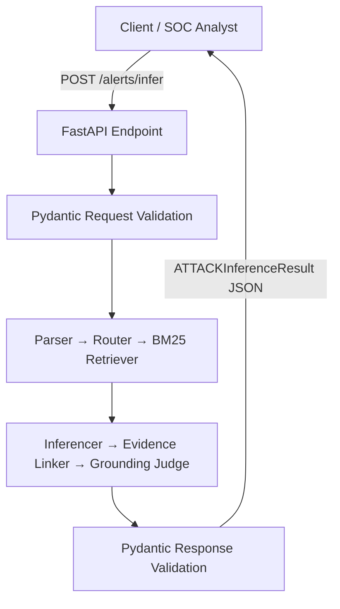
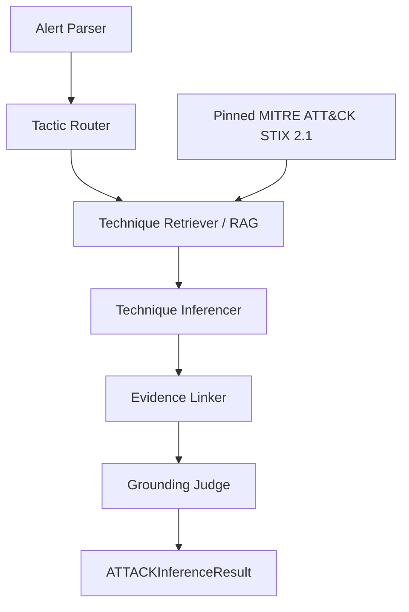
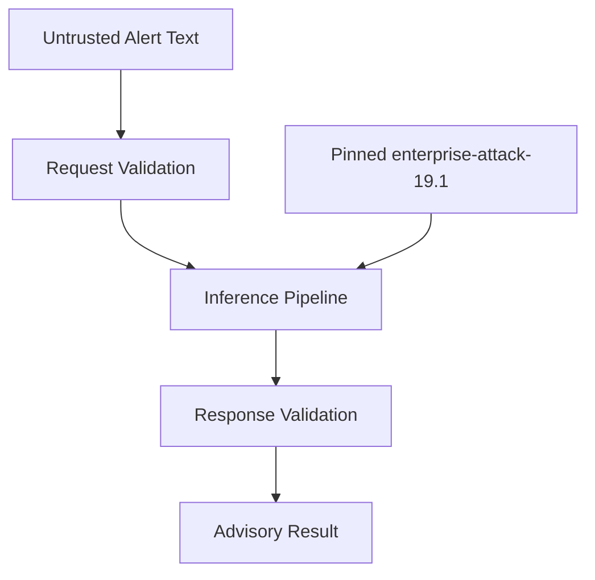

# System and Agent Architecture

## Overview

Security Alert รับข้อความแจ้งเตือนด้านความปลอดภัยผ่าน FastAPI แล้วส่งคืนผลการอนุมาน MITRE ATT&CK Technique ในรูปแบบ JSON ที่ตรวจสอบด้วย Pydantic

ระบบมีสถานะเป็น **early MVP ที่เชื่อม pipeline baseline แล้ว**: `/alerts/infer` เรียก parser, router, BM25 retriever, inferencer, evidence linker และ grounding judge ตามลำดับ ส่วน evaluation, API ที่เหลือ และ production integration ยังอยู่ระหว่างพัฒนา

## Current Architecture

### Request flow

1. Client ส่ง alert ID และข้อความ security alert ไปยัง `POST /alerts/infer`
2. FastAPI รับ request และใช้ Pydantic ตรวจสอบรูปแบบข้อมูล
3. Pipeline ใช้ pinned candidates/allowlist เพื่อค้นและเลือก prediction ได้ไม่เกิน 3 รายการ
4. Evidence Linker และ Grounding Judge กำหนด review flag ตาม structural guardrails
5. Pydantic ตรวจสอบผลลัพธ์ตาม `ATTACKInferenceResult` แล้ว API ส่ง structured JSON กลับไปยัง client

## Target Agent Architecture

| Component | Responsibility | สถานะปัจจุบัน |
| --- | --- | --- |
| FastAPI endpoint | รับ request และเรียก baseline pipeline | ใช้งานได้ระดับ baseline |
| Pydantic schemas | ตรวจสอบ request และ structured response | Required |
| Alert Parser | จัดรูปแบบ narrative และแยก assets, actions และ IOCs | เชื่อม runtime; provider failure fallback แบบปลอดภัย |
| Tactic Router | เลือก tactic ที่น่าจะเกี่ยวข้องเพื่อจำกัดขอบเขตการค้นหา | เชื่อม runtime; provider failure fallback ค้นทุก tactic ใน scope |
| Technique Retriever | ค้นหา candidate techniques จาก pinned STIX subset | BM25 baseline พร้อมใช้; metadata platform/source ยังไม่มี |
| Technique Inferencer | เลือก Technique ID จำนวน 1–3 รายการจาก candidates | เชื่อม runtime |
| Evidence Linker | เชื่อม Technique กับข้อความหลักฐานจาก input | เชื่อม runtime แบบ exact substring |
| Grounding Judge | ตรวจ candidate boundary และ review conditions | เชื่อม runtime; semantic grounding ยังไม่มี |

## Main API Contract

| Method | Endpoint | Input | Output |
| --- | --- | --- | --- |
| `POST` | `/alerts/infer` | Alert narrative | `ATTACKInferenceResult` |

ผลลัพธ์ประกอบด้วย:

- `alert_id`
- `inferred_techniques`
- `candidates_considered`
- `needs_human_review`
- `disclaimer`

## Data and Trust Boundaries

- Alert text เป็น untrusted input และต้องไม่ถูกใช้เป็นคำสั่งควบคุมระบบ
- Technique ID ต้องมีอยู่ใน pinned MITRE ATT&CK Enterprise STIX 2.1 subset เท่านั้น
- ต้องตัด Technique ที่ deprecated หรือ revoked ออกจาก candidates
- Response ทุกครั้งต้องมีข้อความว่า `Advisory tagging only. Not autonomous SOC action. Verify with senior analyst.`
- ระบบไม่ดำเนินการตอบสนองเหตุการณ์หรือบล็อกภัยคุกคามโดยอัตโนมัติ

## Planned Evolution

เติม semantic grounding, platform/source metadata, subset decision, batch/search/evaluate endpoints, typed errors/request ID/timeout/retry, CI, UI และ deployment controls โดยคง API contract และ Pydantic response schema เดิมเพื่อรักษาความเข้ากันได้กับ client
