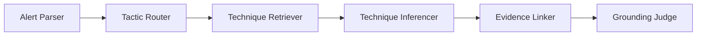

# ระบบอนุมาน MITRE ATT&CK Technique จาก Security Alert

## 1. ปัญหาและเป้าหมาย

นักวิเคราะห์ความปลอดภัยได้รับ Alert, สรุปจาก SIEM และบันทึกเหตุการณ์ในรูปข้อความอิสระ การจับคู่ข้อความเหล่านี้กับ MITRE ATT&CK ทำได้ช้า ไม่สม่ำเสมอ และต้องอาศัยความรู้เฉพาะทาง

**เป้าหมายของระบบ:** รับข้อความ Alert หรือเหตุการณ์ ค้นหา Technique ที่เกี่ยวข้องจากฐานความรู้ MITRE ATT&CK ทางการ และอนุมาน Technique ID ที่มีโอกาสตรงที่สุด พร้อมหลักฐานจากข้อความและค่าความมั่นใจ ระบบมีหน้าที่ให้คำแนะนำเท่านั้น ไม่ดำเนินการตอบสนองเหตุการณ์โดยอัตโนมัติ

**รูปแบบระบบ:** RAG ร่วมกับ zero-shot inference

## 2. ผู้ใช้และกรณีใช้งาน

- **นักวิเคราะห์ SOC Tier 1:** รับคำแนะนำ Technique พร้อมแหล่งอ้างอิงก่อนส่งต่อเหตุการณ์
- **ผู้ฝึกงานด้าน Threat Intelligence:** ฝึกจับคู่สถานการณ์จำลองกับ Enterprise ATT&CK Matrix
- **Detection Engineer:** ตรวจความครอบคลุมของ Alert เทียบกับ Technique label

## 3. ขอบเขตงาน

### อยู่ในขอบเขต

- รับ Alert หรือเหตุการณ์ในรูปข้อความอิสระจากข้อมูลจำลองหรือข้อมูลที่ผู้สอนจัดเตรียม
- ทำ RAG บน MITRE ATT&CK Enterprise STIX 2.1 เวอร์ชันที่ตรึงไว้
- อนุมาน 1–3 Technique ID ต่อ Alert และรองรับหลาย label
- คืน Technique ID, ชื่อ, ค่าความมั่นใจ, ช่วงข้อความหลักฐาน และ tactic
- จำกัด tactic ที่ Initial Access, Execution และ Credential Access ประมาณ 30–50 techniques
- ไม่ใช้ Technique ที่ deprecated หรือ revoked เป็น candidate
- มี Grounding Judge ตรวจว่าผลลัพธ์มีหลักฐานรองรับ

### อยู่นอกขอบเขต

- การตอบสนองหรือบล็อกเหตุการณ์โดยอัตโนมัติ
- การรองรับ Enterprise Matrix ทั้งหมดประมาณ 600+ techniques โดยไม่แบ่ง subset
- Mobile ATT&CK และ ICS ATT&CK
- การใช้ TAXII แบบออนไลน์เป็นเงื่อนไขหลักในการให้คะแนน
- การวิเคราะห์ไฟล์ malware หรือ PCAP

## 4. แหล่งข้อมูลหลักของ Taxonomy

| ระดับ | แหล่งข้อมูล | ตำแหน่ง |
| --- | --- | --- |
| **Codebook หลัก** | MITRE ATT&CK STIX 2.1 JSON เวอร์ชันตรึง | `enterprise-attack-19.1.json` จาก attack-stix-data |
| เอกสารสำหรับมนุษย์ | หน้า MITRE Technique | `https://attack.mitre.org/techniques/enterprise/` |
| ข้อมูลออนไลน์เสริม | TAXII 2.1 | `https://attack-taxii.mitre.org/api/v21/` |
| **Gold label สำหรับประเมินผล** | Alert จำลองที่ผู้สอนกำหนด | ชุดข้อมูลของรายวิชา |

เวอร์ชันที่ใช้ในรายวิชา: `enterprise-attack-19.1` ทุกกลุ่มต้องใช้ไฟล์เดียวกัน

รูปแบบ Technique ID คือ `T####` หรือ `T####.###` เช่น `T1110` Brute Force และ `T1059.001` PowerShell

ฟิลด์ STIX สำคัญสำหรับสร้างดัชนี RAG:

- `external_id`: Technique ID
- `name`, `description`: ชื่อและคำอธิบาย
- `kill_chain_phases`: tactics
- `x_mitre_platforms`: ตัวกรอง platform
- `x_mitre_deprecated`, `revoked`: ใช้คัด Technique ออกจาก candidate

## 5. สถาปัตยกรรม Agent



| Agent | หน้าที่ |
| --- | --- |
| **Alert Parser** | ปรับข้อความให้อยู่ในรูปมาตรฐานและแยก IOC, การกระทำ และ asset |
| **Tactic Router** | ทำนาย tactic ที่น่าจะเกี่ยวข้องเพื่อจำกัดขอบเขตการค้นหา |
| **Technique Retriever** | ค้น top-k candidates จาก STIX subset ที่ตรึงไว้ |
| **Technique Inferencer** | เลือก 1–3 Technique ID จาก candidate ที่ค้นมา |
| **Evidence Linker** | เชื่อมแต่ละ Technique กับช่วงข้อความหลักฐานใน Alert |
| **Grounding Judge** | ปฏิเสธ Technique ที่ไม่มีหลักฐานหรือ ID ที่ระบบสร้างขึ้นเอง |

## 6. โครงสร้างข้อมูล Pydantic

```python
class ParsedAlert(BaseModel):
    narrative: str
    assets: list[str]
    observed_actions: list[str]
    iocs: list[str]

class TechniqueCandidate(BaseModel):
    technique_id: str
    technique_name: str
    tactics: list[str]
    description_excerpt: str
    stix_version: str

class InferredTechnique(BaseModel):
    technique_id: str
    technique_name: str
    tactics: list[str]
    confidence: float
    evidence_spans: list[str]
    mitre_url: str

class ATTACKInferenceResult(BaseModel):
    alert_id: str
    inferred_techniques: list[InferredTechnique]
    candidates_considered: list[TechniqueCandidate]
    needs_human_review: bool
    disclaimer: str
```

## 7. ฐานความรู้และชุดข้อมูล

ข้อมูลจาก MITRE:

- `enterprise-attack-19.1.json`
- subset จำนวน 3 tactics สำหรับ Windows และ Linux โดยตัด deprecated/revoked ออก

ข้อมูลประเมินผลที่ผู้สอนจัดทำ:

- Alert จำลอง 35 รายการ พร้อม gold Technique 1–3 label ต่อรายการ
- กรณีกำกวมหรือมีหลาย Technique 10 รายการ
- Negative control 5 รายการ
- รายการ Technique ที่อนุญาตใน `technique_ids.json`

ตัวอย่าง Alert:

> Host WIN-SRV-04 logged 847 failed RDP authentication attempts from IP 203.0.113.44 between 02:00–04:00 UTC, followed by a successful login and execution of encoded PowerShell.

Gold label: `T1110` Brute Force และ `T1059.001` PowerShell

## 8. API Contract ด้วย FastAPI

| Method | Endpoint | หน้าที่ |
| --- | --- | --- |
| POST | `/alerts/infer` | รับข้อความและคืน `ATTACKInferenceResult` |
| POST | `/alerts/infer/batch` | อนุมานหลาย Alert พร้อมกัน |
| GET | `/taxonomy/techniques` | แสดง Technique ภายใน subset |
| GET | `/taxonomy/techniques/{id}` | แสดงรายละเอียดจาก STIX ที่ตรึงไว้ |
| POST | `/rag/search` | ตรวจ candidate ที่ Retriever ค้นได้ |
| POST | `/evaluate` | ประเมินผลเทียบกับ gold label |

## 9. การประเมินผล

| ตัวชี้วัด | ความหมาย |
| --- | --- |
| **Exact technique F1** | เปรียบเทียบ ID ที่ทำนายกับ gold label แบบ multi-label |
| **Parent technique recall** | ให้คะแนนบางส่วนเมื่อทำนาย parent ของ sub-technique ได้ |
| **Evidence grounding rate** | สัดส่วนผลลัพธ์ที่มีข้อความหลักฐานรองรับ |
| **Hallucinated ID rate** | สัดส่วน ID ที่ไม่มีใน STIX หรือ subset ที่ตรึงไว้ |
| **False-positive rate** | สัดส่วน benign control ที่ระบบกำหนด Technique ให้ผิด |

เกณฑ์ผ่านสำหรับการสาธิต: Exact F1 อย่างน้อย 70%, parent recall อย่างน้อย 90%, hallucinated ID เท่ากับ 0 และ evidence grounding อย่างน้อย 85%

## 10. ความปลอดภัยและ Guardrails

- ถือว่าข้อความ Alert เป็นข้อมูลที่ไม่น่าเชื่อถือและอาจมี prompt injection
- ทุกผลลัพธ์ต้องแจ้งว่าเป็นคำแนะนำเท่านั้นและต้องให้ผู้เชี่ยวชาญตรวจสอบ
- ห้ามสร้าง Technique ID เอง ต้องมีอยู่ใน pinned STIX subset เท่านั้น
- ระบุ MITRE attribution และเวอร์ชันใน metadata ของ API
- ไม่เก็บข้อความ Alert นอก course sandbox ตามการตั้งค่าที่กำหนด

## 11. แผนงานรายสัปดาห์

ใช้กรอบเวลา 6 สัปดาห์ เริ่มวันที่ 20 กรกฎาคม 2026 และใช้ `WORK_PLAN_TH.md` เป็นแหล่งอ้างอิงหลักสำหรับสถานะล่าสุด

| สัปดาห์ | วันที่ | ความสำคัญ | งานหลัก | เกณฑ์ตรวจรับประจำสัปดาห์ |
| --- | --- | --- | --- | --- |
| 1 | 20–26 ก.ค. 2026 | P0 | เปลี่ยน Secret ที่รั่ว หยุดติดตาม `.env` และ bytecode แก้ output path ของ STIX ingestion เพิ่มคู่มือติดตั้ง ตรึง dependency และเพิ่ม Test เบื้องต้นสำหรับ schema, ingestion และ taxonomy API | ติดตั้งใหม่ได้ ไม่มี Secret หรือ bytecode อยู่ใน Git, ingestion เขียนไฟล์ลง `data/processed/` และ Test เบื้องต้นผ่าน |
| 2 | 27 ก.ค.–2 ส.ค. 2026 | P1 | เลือกและบันทึก embedding backend กับรูปแบบ index ปรับ schema ให้รองรับหลาย tactics สร้าง `embedder.py` และ index พร้อม metadata สร้าง `retriever.py` ที่กรอง tactic และกำหนด top-k ได้ เพิ่ม retrieval tests และชุดประเมิน Recall@k เบื้องต้น | Retriever คืน top-k ที่ทำซ้ำได้จาก pinned subset เท่านั้น มี metadata ของ tactic, platform, source และมีผล Recall@1, Recall@3, Recall@5 baseline |
| 3 | 3–9 ส.ค. 2026 | P1 | สร้าง `technique_inferencer.py`, `evidence_linker.py` และ `grounding_judge.py` กำหนดกฎ confidence กับ `needs_human_review` และทดสอบ prompt injection กับ malformed output | ทุกผลลัพธ์เลือกจาก retrieved candidates เท่านั้น มีหลักฐานตรวจย้อนกลับได้ ผ่าน grounding และส่งกรณีไม่แน่ใจให้มนุษย์ตรวจ |
| 4 | 10–16 ส.ค. 2026 | P1–P2 | เชื่อม pipeline จริงเข้ากับ `POST /alerts/infer` ลบผลลัพธ์ hard-coded เพิ่ม validation, timeout, retry, typed errors, prompt versioning, Test แบบ mock, structured logging และ request ID | Endpoint ใช้ pipeline จริง จัดการข้อผิดพลาดอย่างปลอดภัย Test ทำซ้ำได้ และไม่เรียก Gemini จริง |
| 5 | 17–23 ส.ค. 2026 | P1–P2 | สร้างชุดข้อมูลประเมินที่มี positive, multi-technique, ambiguous และ no-match ทำ metric และ evaluation runner บันทึกเวอร์ชัน model, prompt, dataset และ STIX เพิ่ม CI กับ smoke test และกำหนด MVP quality gates | CI ผ่านและสร้างรายงานที่ทำซ้ำได้ มี precision/recall/F1, top-k recall, tactic accuracy, grounding, hallucinated-ID rate และ human-review rate |
| 6 | 24–30 ส.ค. 2026 | P1–P2 | สร้าง UI สำหรับกรอก Alert และแสดง prediction, confidence, evidence และ review จำกัด CORS เพิ่ม authentication/rate limiting ตามการ deploy กำหนด privacy/retention เพิ่ม MITRE attribution, disclaimer และ license จากนั้น deploy และทำ acceptance/security tests | ระบบทำงานครบตั้งแต่ต้นจนจบ และ release candidate ผ่าน acceptance กับ security checks พร้อม attribution, privacy controls และ advisory message |

### ความสัมพันธ์ระหว่างสัปดาห์

1. Week 1 ทำให้ repository สะอาด ติดตั้งซ้ำได้ และมีข้อมูล ATT&CK ที่ถูกต้อง
2. Week 2 สร้าง Retrieval ซึ่งต้องเสร็จก่อนเริ่ม Agent สำหรับ inference
3. Week 3 สร้างส่วนอนุมานและการตรวจหลักฐานที่ Week 4 ต้องนำไปเชื่อม API
4. Week 4 ทำให้ inference pipeline ทำงานครบและมี automated tests
5. Week 5 วัดคุณภาพและป้องกัน regression ก่อนปล่อยระบบ
6. Week 6 ทำ workflow สำหรับนักวิเคราะห์ การ deploy และการตรวจรับขั้นสุดท้าย

## 12. แผนสาธิต 3 นาที

1. ส่ง Alert ที่มี brute force และ PowerShell แล้วแสดง `T1110`, `T1059.001` พร้อมหลักฐาน
2. แสดง top-5 candidates ที่ RAG ค้นได้ก่อน inference
3. ส่ง benign patch-management Alert แล้วแสดง no-match หรือ low-confidence พร้อม review flag
4. ลบหลักฐานแล้วแสดงว่า Judge ปฏิเสธ Technique
5. แสดง F1, parent recall และ hallucination rate

## 13. งานเพิ่มเติม

- ซิงก์ TAXII แบบออนไลน์โดยมี pinned file เป็น fallback
- ส่งออก ATT&CK Navigator layer JSON
- แยกแยะ sub-technique กับ parent technique
- เชื่อมกับ data components หรือ detection strategies

## 14. แหล่ง Dataset

| แหล่งข้อมูล | การใช้งาน |
| --- | --- |
| MITRE attack-stix-data | Taxonomy หลัก STIX 2.1 โดยตรึง `enterprise-attack-19.1.json` |
| MITRE ATT&CK technique pages | คำอธิบายที่มนุษย์อ่านได้สำหรับ RAG |
| OTRF Security-Datasets | สถานการณ์โจมตีจริงสำหรับสร้าง Alert จำลอง |
| Sigma rules | คำอธิบาย Alert ที่จับคู่กับ Technique ได้ |
| Mordor | ชุดข้อมูลจำลองการโจมตีสำหรับเขียน narrative |
| Atomic Red Team | ข้อมูล Technique สำหรับสร้าง Alert จำลอง |
| Splunk BOTS | ตัวอย่างข้อความรูปแบบ SOC เพื่อเพิ่มความสมจริง |

### แนวทางสร้างข้อมูล

ใช้ STIX สาธารณะเป็น Knowledge Base และใช้ Alert ที่ผู้สอนเขียนพร้อมตรวจ label เป็นข้อมูลประเมินผล สามารถใช้ Mordor, Sigma และ Splunk BOTS เป็นแนวทางในการเขียนข้อความ แต่ gold label ต้องได้รับการตรวจโดยผู้สอน

### เงื่อนไขสำคัญ

- ต้องระบุแหล่งที่มา MITRE และเวอร์ชันใน API metadata
- ห้ามสร้าง Technique ID ที่ไม่มีใน pinned subset
- ต้องถือว่า Alert เป็น untrusted input และป้องกัน prompt injection
